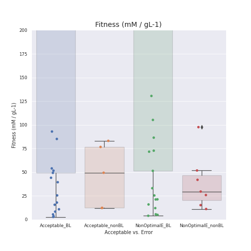
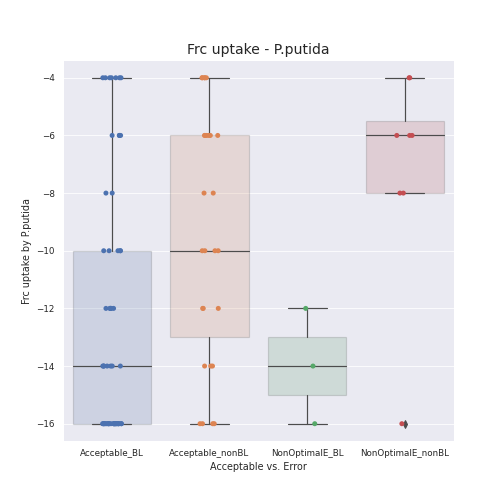
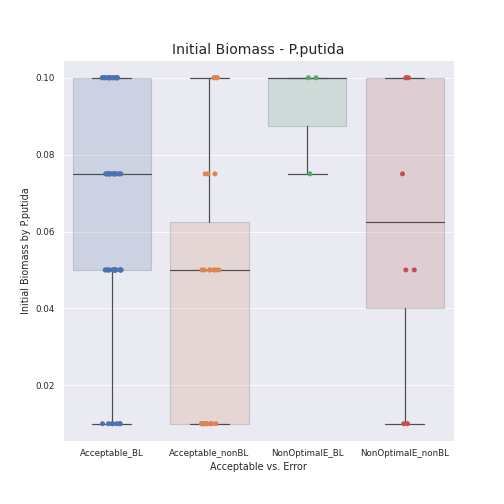

```{r, include = FALSE}
colorize <- function(x, color) {
  if (knitr::is_latex_output()) {
    sprintf("\\textcolor{%s}{%s}", color, x)
  } else if (knitr::is_html_output()) {
    sprintf("<span style='color: %s;'>%s</span>", color, 
      x)
  } else x
}

# USE: Using now color `r colorize("red", "red")`.
```

# 0. Preliminary Notes {#Prel_Notes}

The current analysis was performed to finally assess the effect of nutrient limitations (nitrogen, phosphate) in naringenin production for the *E.coli* iEC1364_W - *P.putida* iJN1463 consortium, using the M9 medium.

In this case, nutrient concentrations were constant for all executions (M9 layout), and the optimization strategy consisted on considering different $NH_4$ and $P_i$ uptake rates as input parameters for SMAC. The **original parameters used in the SMAC optimization** were (`params.pcs` file):

- p1_sucr1 ordinal {-10,-8,-6,-4,-2} [-2]
- p2_biomassEc ordinal {0.05, 0.1, 0.15, 0.20, 0.25} [0.1] 
- p3_frc2 ordinal {-20,-18,-16,-14,-12,-10,-8,-6,-4,-2} [-14]
- p4_biomassKT ordinal {0.05, 0.1, 0.15, 0.20, 0.25} [0.1]
- p5_nh4_Ec ordinal {-6, -4, -3, -2, -1} [-4]
- p6_nh4_KT ordinal {-12, -10, -8, -6, -4, -2} [-10]
- p7_pi_Ec ordinal {-0.5, -0.4, -0.3, -0.2, -0.1} [-0.3]
- p8_pi_KT ordinal {-1, -0.75, -0.50, -0.25, -0.1} [-0.75]

$NH_4$ and $P_i$ uptake rates ranges might be changed in further FLYCOP executions, as part of the guided optimization described in this report.

Moreover, other **layout parameters** to note were:

- **Grid Size (inoculation point)**: 1, 1 (0, 0).
- **Number of cycles**: 240.
- **`maxSpaceBiomass` parameter**: 10.0 gL^-1^.

The **fitness function** is represented here as **naringenin yield** (mM / gL^-1^): total production of this product (mM), divided by final KT biomass (gL^-1^). Note that all scenarios have been run with a **SD (standard deviation) cutoff value of (0.1)·(`avgfitness`)**. \newline

It is worth noticing that the **main concerns of this analysis** were the following ones.

- Finding a range of optimal $NH_4$ and $P_i$ uptake rates for the consortium to be optimized, in order to allow naringenin production under M9 medium conditions.
- Assessing the effect of M9 medium nutrient limitations in naringenin production (either positive, negative or neutral).
- Avoiding biomass loss (as happened in last report FLYCOP runs, "Report on Nutrient Limitations in M9-medium for the *E.coli* iEC1364_W - *P.putida* iJN1463 consortium") because of nutrient limitations.

\newpage
# 1. Base Context FLYCOP run {#BaseContext}

A first FLYCOP run was executed with the parameters stated above, in order to find a preliminary subrange of optimal values for $NH_4$ and $P_i$ uptake rates for subsequent FLYCOP runs. The general distribution of configurations were as follows.

* **10 cases of `ZeroDivisionError`**.
* **44 cases of a different error, `Non-optimal solution obtained`**. These cases were included in the final datatable of "configurationsResults_Scenario0.txt".

  - 7 of these cases did not experience biomass loss.
  - 37 of these cases did experience biomass loss.

* **46 acceptable cases**, without COBRA errors.

  - 5 of these cases did not experience biomass loss (none of which with excessive SD).
  - 41 of these cases did experience biomass loss.
  
Given these results, the performed analysis consisted on comparing a series of input and output parameters for each set of configurations (boxplot+scatter).

* **Acceptable cases**. Further subdivision, biomass loss *vs*. non-biomass loss configurations.
* **NonOptimalConfig cases**. Further subdivision, biomass loss *vs*. non-biomass loss configurations.

Note that an excessive SD was *not* considered as criteria for removing a given configuration from the analysis. However, it might be required to consider in further FLYCOP executions. In any case, there were just 10 cases of excessive SD: 5 of them, *NonOptimalConfig* cases with biomass loss; the remaining 5, *Acceptable* cases with biomass loss.


## 1.1. $NH_4$ uptakes rates

These values are negative under COBRA / SMAC optimization. Please, consider the absolute value while reading these interpretations.

### 1.1.1. For *Escherichia coli*

For those configurations with **NonOptimalConfig**, $NH_4$ uptake rates were:

* evenly distributed from -6 to -1 in the case of *biomass loss*.
* evenly distributed from -4 to -1 in the case of *non biomass loss*. They tended to lower values (near -1).

For those **Acceptable** configurations, $NH_4$ uptake rates were:

* evenly distributed from -6 to -2 in the case of *biomass loss*.
* concentrated in -3 (3 cases), except for one case in -2 and another case in -6 (outliers); in the case of *non biomass loss*.

Therefore, a very low $NH_4$ uptake rate for *E.coli* (-2 or higher, negative value) might lead to non-optimal solutions. Moreover, a value under -4 (negative value) might also lead to a non-optimal solution and/ or to biomass loss. A potential better subrange for this parameter (`NH4_Ec`) would be (-2, -4). Note that this parameter might also be interrelated to other input parameter values: this individual effect of $NH_4$ uptake rate for *E.coli* would be just a partial cause for the outcome obtained.

### 1.1.2. For *Pseudomonas putida*

For those configurations with **NonOptimalConfig**, $NH_4$ uptake rates were:

* evenly distributed from -12 to -2 in the case of *biomass loss*.
* evenly distributed from -10 to -2 in the case of *non biomass loss*.

For those **Acceptable** configurations, $NH_4$ uptake rates were:

* evenly distributed from -12 to -2 in the case of *biomass loss*.
* concentrated in -12 to -10 (4 cases), except for one case in -4 (outlier); in the case of *non biomass loss*.

Thus a low $NH_4$ uptake rate for *P.putida* (above -10 or -8, negative value) might lead to non-optimal solutions, or acceptable solutions but with biomass loss. A potential better subrange for this parameter (`NH4_KT`) would be (-10, -12). Note that this parameter might also be interrelated to other input parameter values: this individual effect of $NH_4$ uptake rate for *P.putida* would be just a partial cause for the outcome obtained. \newline

{width=50%}
{width=50%}


## 1.2. $P_i$ uptakes rates
### 1.2.1. For *Escherichia coli*

For those configurations with **NonOptimalConfig**, $P_i$ uptake rates were:

* distributed from -0.50 to -0.10 in the case of *biomass loss*, but more concentrated in the rank of -0.30 to -0.10.
* evenly distributed from -0.40 to -0.10 in the case of *non biomass loss*.

For those **Acceptable** configurations, $P_i$ uptake rates were:

* evenly distributed from -0.50 to -0.30 in the case of *biomass loss*. Certain outliers around -0.20.
* dispersed to some extent, between -0.50 to -0.20, in the case of *non biomass loss*.

Therefore, $P_i$ uptake for *E.coli* might not be specially influential in the outcome of the configuration, though a too low value (above -0.20, negative value) might not be a good choice (leading to non-optimal solutions). An acceptable subrange for this parameter (`Pi_Ec`) would be (-0.20, -0.50). Again, note the inter-relation between input parameter values for the unbiased interpretation of the final outcome obtained.

### 1.2.2. For *Pseudomonas putida*

For those configurations with **NonOptimalConfig**, $P_i$ uptake rates were:

* evenly distributed from -1.0 to -0.1 in the case of *biomass loss*.
* evenly distributed from -1.0 to -0.1 in the case of *non biomass loss*. The value of -0.1 could be considered an outlier.

For those **Acceptable** configurations, $NH_4$ uptake rates were:

* evenly distributed from -1.0 to -0.1 in the case of *biomass loss*.
* dispersed to some extent, between -1.0 to -0.30, in the case of *non biomass loss*.

Thus $P_i$ uptake for *P.putida* might not be specially influential in the outcome of the configuration. An acceptable subrange for this parameter (`Pi_KT`) would be (-0.30, -1.0), avoiding too low values (-0.2 or higher, negative value). Again, note the inter-relation between input parameter values for the unbiased interpretation of the final outcome obtained. \newline

{width=50%}
{width=50%}

## 1.3. Carbon source uptake rates
### 1.3.1. For *Escherichia coli*

For those configurations with **NonOptimalConfig**, sucrose uptake rates were:

* evenly distributed from -10 to -2 in the case of *biomass loss*.
- taking values of -8 (2 cases) and -6 (5 cases), in the case of *non biomass loss*.

For those **Acceptable** configurations, sucrose uptake rates were:

- taking values of -2 and -4, in the case of *biomass loss*. Certain outliers around -8.0.
- esentially concentrated in -2, in the case of *non biomass loss*. One outlier in -4.

Therefore, high or very high values of sucrose uptake for *E.coli* (under -4, negative values) might lead to non-optimal solutions. A potential better subrange for this parameter (`sucr1`) would be (-2, -4) - lower values might also avoid biomass loss in acceptable configurations. Again, note the inter-relation between input parameter values for the unbiased interpretation of the final outcome obtained.

### 1.3.2. For *Pseudomonas putida*

For those configurations with **NonOptimalConfig**, fructose uptake rates were:

* evenly distributed from -20 to -2.5 in the case of *biomass loss*.
* evenly distributed from -7.5 to -2.5 in the case of *non biomass loss*. 

For those **Acceptable** configurations, fructose uptake rates were:

* evenly distributed from -20 to -2.5 in the case of *biomass loss*.
* dispersed to some extent, between -16 to -4, in the case of *non biomass loss*.

Thus a less error-prone subrange of fructose uptake rates might be (-4, -16), avoiding the values in the extremes of the interval considered so far. However, this value rate might be inter-related to other input parameters in the determination of the final outcome of a given configuration. \newline

{width=50%}
{width=50%}


## 1.4. Final sucrose concentration (consumed by *E.coli*)

For those configurations with **NonOptimalConfig**, final sucrose concentrations were:

* evenly distributed from 100 to 0 (mM) in the case of *biomass loss*.
* evenly distributed from 90 to 60 (mM) in the case of *non biomass loss*. One outlier around 30 mM.

For those **Acceptable** configurations, final sucrose concentrations were:

* evenly distributed from 90 to 0 (mM) in the case of *biomass loss*.
* dispersed to some extent, between 85 to 10 (mM), in the case of *non biomass loss*.

Thus in those cases with no biomass loss, final sucrose concentrations were never exhausted, but there are some configurations with sucrose exhaustion within the sets of biomass loss for both acceptable and NonOptimalConfig groups. \newline


## 1.5. Oxygen final concentrations

This nutrient (oxygen) would be consumed by both microorganisms. For those configurations with **NonOptimalConfig**, final oxygen concentrations were:

* distributed from 1000 to 850 (mM) in the case of *biomass loss*, with one outlier in 775 mM.
* evenly distributed between 975 to 925 (mM) in the case of *non biomass loss*.

For those **Acceptable** configurations, final oxygen concentrations were:

* distributed from 1000 to 750 (mM) in the case of *biomass loss*. Higher concentration of points between 1000 and 850 mM.
- 2 points in 950 mM, 1 point around 900 mM, 1 point around 875 mM, 1 point around 825 mM; in the case of *non biomass loss*.

Thus oxygen consumption did not seem to be an important output difference between the categories here considered. \newline

{width=50%}
{width=50%}


## 1.6. Initial Biomass values
### 1.6.1. For *Escherichia coli*

For those configurations with **NonOptimalConfig**, initial *E.coli* concentrations were:

* evenly distributed from 0.05 to 0.25 (gL^-1^) in the case of *biomass loss*.
* evenly distributed from 0.05 to 0.15 (gL^-1^) in the case of *non biomass loss*. One outlier around 0.25 gL^-1^.

For those **Acceptable** configurations, initial *E.coli* concentrations were:

* evenly distributed from 0.05 to 0.25 (gL^-1^) in the case of *biomass loss*.
- 2 points taking a value of 0.05 gL^-1^, 2 points in 0.10 gL^-1^, 1 outlier (0.25 gL^-1^); in the case of *non biomass loss*.

Thus these configurations with nitrogen limitation and restricted $NH_4$ uptake rates benefit from lower values of initial *E.coli* biomass (0.05 or lower, 0.1) (gL^-1^).

### 1.6.2. For *Pseudomonas putida*

For those configurations with **NonOptimalConfig**, initial *P.putida* concentrations were:

* evenly distributed from 0.05 to 0.25 (gL^-1^) in the case of *biomass loss*.
* evenly distributed from 0.05 to 0.20 (gL^-1^) in the case of *non biomass loss*. One outlier around 0.25 gL^-1^.

For those **Acceptable** configurations, initial *P.putida* concentrations were:

* evenly distributed from 0.05 to 0.25 (gL^-1^) in the case of *biomass loss*.
- 4 points in 0.05 gL^-1^, 1 point in 0.1 gL^-1^ (outlier); in the case of *non biomass loss*.

Thus these configurations with nitrogen limitation and restricted $NH_4$ uptake rates also benefit from lower values of initial *P.putida* biomass (0.01 - 0.075) (gL^-1^). \newline

{width=50%}
{width=50%}

## 1.7. Final Biomass values
### 1.7.1. For *Escherichia coli*

For those configurations with **NonOptimalConfig**, final *E.coli* concentrations were:

* evenly distributed from 0.00 to 1.00 (gL^-1^) in the case of *biomass loss*. There was a certain concentration of points near 0.0 gL^-1^.
* evenly distributed from 0.10 to 0.30-0.40 (gL^-1^) in the case of *non biomass loss*. One outlier around 1.60 gL^-1^.

For those **Acceptable** configurations, final *E.coli* concentrations were:

* evenly distributed from 0.00 to 2.00 (gL^-1^) in the case of *biomass loss*.
- 3 points around 1.0 gL^-1^, 2 points around 2.0 gL^-1^; in the case of *non biomass loss*.

Thus the higher final *E.coli* concentrations were obtained for acceptable configurations without biomass loss. In this category there were no values of final *E.coli* near 0.

### 1.7.2. For *Pseudomonas putida*

For those configurations with **NonOptimalConfig**, final *P.putida* concentrations were:

* distributed from 0.00 to 1.75 (gL^-1^) in the case of *biomass loss*. There was a certain concentration of points near 0.0 gL^-1^.
* evenly distributed from 0.10 to 1.0 (gL^-1^) in the case of *non biomass loss*. 

For those **Acceptable** configurations, final *P.putida* concentrations were:

* evenly distributed from 0.00 to 1.10 (gL^-1^) in the case of *biomass loss*. There was a certain concentration of points near 0.0 gL^-1^.
-2 points around 0.50 gL^-1^, 2 points around 0.75 gL^-1^, 1 point around 1.0 gL^-1^; in the case of *non biomass loss*.

Thus the higher final *P.putida* concentrations were obtained for acceptable configurations without biomass loss. In this category there were no values of final *P.putida* near 0. \newline

{width=50%}
{width=50%}

## 1.8. Final production (naringenin and p-coumarate)
### 1.8.1. p-Coumarate by *Escherichia coli*

For those configurations with **NonOptimalConfig**, final pCA concentrations were:

* distributed from 0 to 50 (mM) in the case of *biomass loss*, with a higher concentration of points under 15 mM (values above 35 mM might be considered outliers). 
- 5 points 0 or near 0 mM, 1 value around 5 mM, 1 value around 15 mM, in those cases of *non biomass loss*.

For those **Acceptable** configurations, final pCA concentrations were:

* evenly distributed from 0 to 30 mM in the case of *biomass loss*. Higher concentration of points under 10 mM.
- All values in 0 or near 0 mM, in the case of *non biomass loss*.

Thus the best category in terms of final pCA (the lower, the better) would be the one with acceptable configurations without biomass loss.

### 1.8.2. Naringenin by *Pseudomonas putida*

For those configurations with **NonOptimalConfig**, final naringenin concentrations were:

* distributed from 0 to 30 (mM) in the case of *biomass loss*, with a higher concentration of points under 10 mM (values above 25 mM can be considered outliers). 
- even distribution of points between 10 to 20 mM, with one outlier around 25 mM; in those cases of *non biomass loss*.

For those **Acceptable** configurations, final naringenin concentrations were:

* distributed from 0 to 25 mM in the case of *biomass loss*, with a higher concentration of points under 10 mM. Also, some ouliers from 40 to 100 mM.
- 2 points around 10 mM, 1 point around 25 mM, 1 point around 35 mM, 1 point (outlier) around 80 mM; in the case of *non biomass loss*.

Thus the best category in terms of final naringenin would be the one with acceptable configurations without biomass loss: intermediate concentration, no values near 0 neither too disproportionate. \newline

{width=50%}
{width=50%}

## 1.9. Nitrogen final concentrations 

This nutrient ($NH_4$) would be consumed by both microorganisms. For those configurations with **NonOptimalConfig**, final $NH_4$ concentrations were:

* distributed from 18 to 0 (mM) in the case of *biomass loss*. Higher concentration of points between 10 to 18 mM.
* evenly distributed from 18 to 0 (mM) in the case of *non biomass loss*.

For those **Acceptable** configurations, final $NH_4$ concentrations were:

* evenly distributed from 18 to 0 (mM) in the case of *biomass loss*. Intermediate cluster of points in 0 mM.
- all values in 0 mM, in the case of *non biomass loss*.

Interestingly, $NH_4$ was always exhausted in those cases of acceptable configurations *without* biomass loss, as opposed to the rest of categories here considered. \newline

## 1.10. Phosphate final concentrations 

This nutrient ($P_i$) would be consumed by both microorganisms. For those configurations with **NonOptimalConfig**, final $P_i$ concentrations were:

* distributed from 70 to 66 (mM) in the case of *biomass loss*, with certain outliers between 66 and 50 mM. Some configurations with very subtle production of $P_i$.
* distributed between 69 to 58 (mM) in the case of *non biomass loss*.

For those **Acceptable** configurations, final $P_i$ concentrations were:

* evenly distributed from 68 to 62 (mM) in the case of *biomass loss*. Certain outliers between 62 and 50 mM.
- 2 points in 67.5 mM, 1 point around 64 mM, 1 point around 60 mM, 1 point around 57.5 mM; in the case of *non biomass loss*.

Therefore, phosphate consumption would be moderate in all configurations here analyzed, being between 1-2 mM to 10 mM during the whole simulation. However, it seemed to be more pronounced in those acceptable configurations without biomass loss, where $NH_4$ was always finally exhausted. \newline

{width=50%}
{width=50%}

## 1.11. Fitness (naringenin yield) (mM / gL^-1^)

Recall that fitness is defined as naringenin yield (mM / gL^-1^): total production of this product (mM), divided by final KT biomass (gL^-1^). For those configurations with **NonOptimalConfig**, fitness values were:

* distributed from near 0 to a disproportionate value (not checked) in the case of *biomass loss*. Disproportionate values were the result of intermediate naringenin production with very low *P.putida* final biomass.
* evenly distributed between 10 to 50, with one outlier around 100; in those cases of *non biomass loss*.

For those **Acceptable** configurations, final oxygen concentrations were:

* distributed from near 0 to a disproportionate value (not checked) in the case of *biomass loss*. Disproportionate values were the result of intermediate naringenin production with very low *P.putida* final biomass.
- 2 points in 10, 1 point around 50, 2 points around 75; in the case of *non biomass loss*.

Fitness might not be a good reference for configurations comparison in this FLYCOP run, since it would be moderately or severely influenced by biomass loss and final values of *P.putida* biomass. \newpage

{width=50%}


## 1.12. Quick Conclusions and setting a new (optimized) FLYCOP run

The **main conclusions** obtained from the last FLYCOP run were the following ones.

* There were an important number of **non-optimal configurations**, possibly due to limitations related to nitrogen availability and $NH_4$ uptake rates for both microbes (generally excessive for a restricted $NH_4$ initial concentration).

* Despite the last statement, **$NH_4$ was finally exhausted in all 5 acceptable configurations without biomass loss** (pay attention to this detail in FLYCOP runs to come).

* **Phosphate consumption** was moderate in general, though slightly more pronounced in those 5 acceptable configurations without biomass loss.

* *E.coli* development seem to benefit from a **lower sucrose uptake rate**. On the other hand, *P.putida* also experience a more even growth under **a more compact range of fructose uptake rates** (avoid last extreme values set).

* **Initial biomass values** should be between (approx.) 0.05 and 0.1 gL^-1^ for a better evolution of the consortium in time.

* In general, the **main output parameters** (final biomass values, naringenin and pCA final concentrations, final sucrose) had **better results in the group of acceptable configurations without biomass loss**.

* **Fitness values were not very indicative**, since they were somewhat biased by the *non-optimal configuration* effect and biomass loss. Ideally, the significance of this parameter should be regained in further FLYCOP executions. \newline

Given these facts, the **guided optimization** for the FLYCOP parameters in the current report lead to the execution of a new FLYCOP run with the next parameters (SMAC input parameters).

- p1_sucr1 ordinal {-3.5,-3,-2.5,-2,-1.5, -1} [-2]
- p2_biomassEc ordinal {0.01,0.05,0.075,0.1} [0.05] 
- p3_frc2 ordinal {-16,-14,-12,-10,-8,-6,-4} [-14]
- p4_biomassKT ordinal {0.01,0.05,0.075,0.1} [0.05]
- p5_nh4_Ec ordinal {-3,-2.5,-2,-1.5} [-3]
- p6_nh4_KT ordinal {-12,-11.5,-11,-10.5,-10} [-12]
- p7_pi_Ec ordinal {-0.5, -0.4, -0.3, -0.2} [-0.3]
- p8_pi_KT ordinal {-1, -0.75, -0.50, -0.3} [-0.75]

The rest of parameters took the same value as in the recently commented FLYCOP run.

\newpage
# 2. First optimized FLYCOP run {#FirstOpt}

In the first optimized FLYCOP run (SMAC-parameters optimized), the general distribution of configurations were as follows.

* **0 cases of `ZeroDivisionError`**.
* **12 cases of `Non-optimal solution obtained`**. These cases were included in the final datatable of "configurationsResults_Scenario0.txt".

  - 8 of these cases did not experience biomass loss. All of them with acceptable SD (< 10% average fitness).
  - 4 of these cases did experience biomass loss. 3 of them with acceptable SD (< 10% average fitness).

* **88 acceptable cases**, without COBRA errors (in this case, the *Non-optimal solution* COBRA error).

  - 28 of these cases did not experience biomass loss. 27 of them with acceptable SD (< 10% average fitness).
  - 60 of these cases did experience biomass loss. 56 of them with acceptable SD (< 10% average fitness).
  
Given these results, the performed analysis consisted on comparing a series of input and output parameters for each set of configurations (boxplot+scatter).

* **Acceptable cases**. Further subdivision, biomass loss *vs*. non-biomass loss configurations.
* **NonOptimalConfig cases**. Further subdivision, biomass loss *vs*. non-biomass loss configurations.

Note that an excessive SD was considered here as criterion for removing a given configuration from the analysis. Total of cases with SD excessive values: 6 in 100 configurations.

In this new analysis, the number of configurations with the COBRA error *NonOptimalConfig* dropped from 44 to 12, which might indicate that the adaptation of SMAC parameters might have lead to a decrease in the number of these type of cases. It is also noticeable that there were no cases of *ZeroDivisionError* in this configuration.

On the other hand, the number of cases with biomass loss was still high (60 acceptable cases + 4 cases with error, a total of 64 cases). However. the number of configurations within the reference group (acceptable configurations, no biomass loss) was 28, thus a higher number than in the previous execution.

Note that for the further plotting, the configurations with an excessive SD (> 10% avg fitness) were discarded in the four groups.


## 2.1. $NH_4$ uptakes rates

These values are negative under COBRA / SMAC optimization. Please, consider the absolute value while reading these interpretations.

### 2.1.1. For *Escherichia coli*

For those configurations with **NonOptimalConfig**, $NH_4$ uptake rates were:

* under -1.6 (all 3 cases) in the case of *biomass loss*.
* under -1.6 (6 cases) or in -2.0 (2 remaining cases); in the case of *no biomass loss*.

For those **Acceptable** configurations, $NH_4$ uptake rates were:

* evenly distributed between -1.5 to -3.0 in the case of *biomass loss*.
* evenly distributed between -1.5 to -3.0 in the case of *no biomass loss*.

Therefore, a very low $NH_4$ uptake rate for *E.coli* (above -1.6) might lead to non-optimal solutions. At the same time, there were no significant differences between acceptable configurations with biomass loss *vs*. without biomass loss. Therefore, death effect might require an interaction between $NH_4$ uptake (*E.coli*) and other parameters to happen.

### 2.1.2. For *Pseudomonas putida*

For those configurations with **NonOptimalConfig**, $NH_4$ uptake rates were:

* 1 value in -10.0, 2 values in -12.0, in the case of *biomass loss*.
* somewhat dispersed from -12.0 to -10.0, in the case of *no biomass loss*.

For those **Acceptable** configurations, $NH_4$ uptake rates were:

* evenly distributed from -12.0 to -10.0, in the case of *biomass loss*.
* evenly distributed from -12.0 to -10.0, in the case of *no biomass loss*. Slightly higher concentration of points in -12.0 and -10.0.

Thus the subrange of $NH_4$ uptake values for *P.putida* that seemed to produce acceptable results was (-11.0, -12.0). There were no clear differences between biomass loss *vs*. no biomass loss, though $NH_4$ uptake rates above -11.0 seem to be prone to produce biomass loss (more likely values under the biomass loss group of acceptable configurations). The influence of other nutrients would be important to be considered to account for the final outcome in each configuration.

{width=50%}
{width=50%}


## 2.2. $P_i$ uptakes rates

These values are negative under COBRA / SMAC optimization. Please, consider the absolute value while reading these interpretations.

### 2.2.1. For *Escherichia coli*

For those configurations with **NonOptimalConfig**, $P_i$ uptake rates were:

* evenly distributed from -0.50 to -0.30 in the case of *biomass loss*.
* evenly distributed from -0.50 to -0.20 in the case of *no biomass loss*.

For those **Acceptable** configurations, $P_i$ uptake rates were:

* evenly distributed from -0.50 to -0.20 in the case of *biomass loss*. The number of values in -0.20 was not as high as the number of points in -0.30, -0.40, -0.50.
* evenly distributed from -0.50 to -0.20, in the case of *no biomass loss*.

Therefore, $P_i$ uptake for *E.coli* might not be specially influential in the outcome of the configuration.

### 2.2.2. For *Pseudomonas putida*

For those configurations with **NonOptimalConfig**, $P_i$ uptake rates were:

* 2 values in -0.75, 1 values in -0.30; in the case of *biomass loss*.
* evenly distributed from -1.0 to -0.3 in the case of *no biomass loss*. 

For those **Acceptable** configurations, $NH_4$ uptake rates were:

* evenly distributed from -1.0 to -0.3 in the case of *biomass loss*.
* distributed from -1.0 to -0.3 in the case of *no biomass loss*. However, values of -0.75 and -1.0 were more abundant.

Thus $P_i$ uptake for *P.putida* might not be specially influential in the outcome of the configuration. However, avoiding too low values (above -0.50) could have a subtle positive effect (reducing) those acceptable configurations with biomass loss. \newline

{width=50%}
{width=50%}

## 2.3. Carbon source uptake rates

These values are negative under COBRA / SMAC optimization. Please, consider the absolute value while reading these interpretations.

### 2.3.1. For *Escherichia coli*

For those configurations with **NonOptimalConfig**, sucrose uptake rates were:

* evenly distributed from -3.5 to -2.5 in the case of *biomass loss*.
* evenly distributed from -3.5 to -2.5 in the case of *no biomass loss*.

For those **Acceptable** configurations, sucrose uptake rates were:

- evenly distributed from -3.5 to -1.0 in the case of *biomass loss*.
- essentially concentrated in -2.0, -1.5 and -1.0 values, in the case of *no biomass loss*. Also 2 points in -2.5 and 1 point in -3.0.

Therefore, the best values for sucrose uptake (*E.coli*) would be those equal or above -2.0. Too high values (from -4.0 to -2.5) happened frequently in non-optimal configurations. As for the case of acceptable configurations with biomass loss, there might be more factors determining the outcome of death effect apart from sucrose uptake.


### 2.3.2. For *Pseudomonas putida*

For those configurations with **NonOptimalConfig**, fructose uptake rates were:

* evenly distributed from -16 to -12 in the case of *biomass loss*.
* distributed from -8 to -4 in the case of *no biomass loss*. There was only 1 point in -4, and also 1 outlier in -16.

For those **Acceptable** configurations, fructose uptake rates were:

* evenly distributed from -16 to -4 in the case of *biomass loss*. The interquartile range (IQR) extended from -16 to -10.
* evenly distributed from -16 to -4 in the case of *no biomass loss*. However, in this case the interquartile range (IQR) was extended from -12 to -6 (more centric in the interval of fructose uptake rates).

Thus a less error-prone subrange of fructose uptake rates might be (-12, -6), avoiding the values in the extremes of the interval considered so far. The non-optimal solutions might be affected by these *more extreme* fructose uptake values (*P.putida*), but again this would be a partial effect in a combined influence of the many input parameters in the final configuration outcome. \newline

{width=50%}
{width=50%}

## 2.4. Final sucrose concentration (consumed by *E.coli*)

For those configurations with **NonOptimalConfig**, final sucrose concentrations were:

* 2 points near 100 mM (95 mM), 1 point aorund 85 mM; in the case of *biomass loss*.
* distributed between 95 to 70 mM, in the case of *no biomass loss*. One outlier around 55-60 mM.

For those **Acceptable** configurations, final sucrose concentrations were:

* distributed from 100 to 50 (mM) in the case of *biomass loss*. Higher concentration of points between 90 to 100 mM. 1 outlier in 30 mM.
* dispersed between 100 to 75 (mM), in the case of *no biomass loss*. Higher concentration of points between 85 to 100 mM. 2 outliers in 65 and 70 mM.

Thus sucrose consumption was not very pronounced, specially in those cases of acceptable configurations without biomass loss. Note that there were no configurations with full sucrose consumption at all. \newline

## 2.5. Oxygen final concentrations

This nutrient (oxygen) would be consumed by both microorganisms. For those configurations with **NonOptimalConfig**, final oxygen concentrations were:

* 2 points near 1000 mM, 1 point around 980-990 mM.
* evenly distributed between 990 to 940 (mM) in the case of *no biomass loss*.

For those **Acceptable** configurations, final oxygen concentrations were:

* distributed from 1000 to 900 (mM) in the case of *biomass loss*. Higher concentration of points between 1000 and 950 mM.
* distributed from 1000 to 900 (mM) in the case of *biomass loss*. Higher concentration of points between 1000 and 950 mM. Those points under 920 might be considered outliers.

Thus oxygen consumption did not seem to be an important output difference between the categories here considered. \newline

**Note that** $NH_4$, $P_i$, sucrose and oxygen final levels were somewhat similar for those acceptable configurations with and without biomass loss.

{width=50%}
{width=50%}

## 2.6. Initial Biomass values
### 2.6.1. For *Escherichia coli*

For those configurations with **NonOptimalConfig**, initial *E.coli* concentrations were:

* 2 points in 0.01 and 1 point in 0.075 (gL^-1^) in the case of *biomass loss*.
* evenly distributed from 0.01 to 0.1 (gL^-1^) in the case of *no biomass loss*. Higher concentration of points in 0.05 and 0.075 (gL^-1^).

For those **Acceptable** configurations, initial *E.coli* concentrations were:

* evenly distributed from 0.01 to 0.1 (gL^-1^) in the case of *biomass loss*. The IQR was centered in (0.05, 0.1). There was an important amount of points in 0.01 gL^-1^.
* evenly distributed from 0.01 to 0.1 (gL^-1^) in the case of *no biomass loss*. The IQR was centered in (0.05, 0.1). The amount of points in 0.01 gL^-1^ was lower than with biomass loss.

Thus these configurations with nitrogen limitation and restricted $NH_4$ uptake rates benefit from values of initial *E.coli* biomass within (0.05, 0.1) (gL^-1^). The non-optimal configurations might have been negatively influenced by too low initial values for *E.coli* biomass.

### 2.6.2. For *Pseudomonas putida*

For those configurations with **NonOptimalConfig**, initial *P.putida* concentrations were:

* 2 points in 0.1 and 1 point in 0.075 (gL^-1^) in the case of *biomass loss*.
* evenly distributed from 0.01 to 0.1 (gL^-1^) in the case of *no biomass loss*. The values in 0.01 gL^-1^ might be considered outliers.

For those **Acceptable** configurations, initial *P.putida* concentrations were:

* evenly distributed from 0.01 to 0.1 (gL^-1^) in the case of *biomass loss*.
* distributed from 0.01 to 0.1 (gL^-1^) in the case of *no biomass loss*. However, the IQR was centered in (0.01, 0.05), with a lower number of points in 0.075 and 0.10 (gL^-1^).

Thus these configurations with nitrogen limitation and restricted $NH_4$ uptake rates benefit from lower values of initial *P.putida* biomass (0.01 - 0.05) (gL^-1^). It is likely that higher initial values would be related with biomass loss or non-optimal FLYCOP solutions. \newline

{width=50%}
{width=50%}

## 2.7. Final Biomass values
### 2.7.1. For *Escherichia coli*

For those configurations with **NonOptimalConfig**, final *E.coli* concentrations were:

* 2 points in 0.10 and 1 point in 0.50 (gL^-1^).
* distributed from 0.10 to 1.30 (gL^-1^) in the case of *no biomass loss*. 

For those **Acceptable** configurations, final *E.coli* concentrations were:

* evenly distributed from 0.10 to 1.25 (gL^-1^) in the case of *biomass loss*. Some outliers in 1.50 and 1.75-1.80 gL^-1^. IQR = (0.25, 0.80) gL^-1^.
* evenly distributed from 0.10 to 1.25 (gL^-1^) in the case of *no biomass loss*. Some outliers in 1.75 gL^-1^. IQR = (0.25, 1.00) gL^-1^.

Thus the higher final *E.coli* concentrations were obtained for acceptable configurations, with a slightly better distribution for those cases without biomass loss. However, there were no substantial differences between acceptable configurations with and without biomass loss. Thus it is likely though that *E.coli* would not be the microbe experiencing here the commented death effect.


### 2.7.2. For *Pseudomonas putida*

For those configurations with **NonOptimalConfig**, final *P.putida* concentrations were:

* near 0.0 gL^-1^ in all 3 cases.
* evenly distributed from 0.10 to 0.8 (gL^-1^) in the case of *no biomass loss*. 

For those **Acceptable** configurations, final *P.putida* concentrations were:

* evenly distributed from 0.00 to under 0.20 (gL^-1^) in the case of *biomass loss*. There were many outliers with values from 0.3 to 1.10 gL^-1^.
* distributed from 0.10 to 0.60 (gL^-1^) in the case of *no biomass loss*. The IQR was centered in (0.10, 0.50) gL^-1^, with some values in the upper boxplot whisker (0.60 - 0.80) gL^-1^.

Thus the higher final *P.putida* concentrations were obtained for acceptable configurations without biomass loss. It is likely that the microbe experiencing biomass loss in this FLYCOP run was *P.putida*, since there is a very important difference between boxes of biomass loss *vs*. no biomass loss for those acceptable configurations (an issue that did not happened for *E.coli*). \newline

{width=50%}
{width=50%}

## 2.8. Final production (naringenin and p-coumarate)
### 2.8.1. p-Coumarate by *Escherichia coli*

For those configurations with **NonOptimalConfig**, final pCA concentrations were:

* 2 points in 0 or near 0 mM, 1 point in 6 mM; in the case of *biomass loss*.
* all 8 points in 0 or near 0 mM in the case of *no biomass loss*.

For those **Acceptable** configurations, final pCA concentrations were:

* distributed from 0 to 4 mM in the case of *biomass loss*. Higher concentration of points under 3 mM. Some outliers around 6 to 9 mM.
- All values in 0 or near 0 mM, in the case of *no biomass loss*.

A higher final p-coumarate concentration in acceptable configurations with biomass loss would make sense: since the microbe which would be dying in the media is *P.putida*, in those cases with death effect less pCA is consumed, thus having a higher final concentration. \newline


### 2.8.2. Naringenin by *Pseudomonas putida*

For those configurations with **NonOptimalConfig**, final naringenin concentrations were:

* all 3 points around 2 to 3 mM, in those cases with *biomass loss*.
- distribution of points between 0 to 8 mM, with two outliers around 23 and 36 mM; in those cases of *no biomass loss*.

For those **Acceptable** configurations, final naringenin concentrations were:

* distributed from 0 to 20 mM in the case of *biomass loss*, with a higher concentration of points under 5 mM and near 0. Also, two ouliers around 20 and 30 mM.
* distributed from 0 to 20 mM in the case of *no biomass loss*, with a higher concentration of points under 5 mM. Also, two ouliers around 25 and 32 mM.

Thus final naringenin production was low to moderate in those acceptable configurations, with IQR centered in ranges as (near 0 to 8-10 mM). These would not be satisfying values for final naringenin production. \newline

{width=50%}
{width=50%}

## 2.9. Nitrogen final concentrations 

This nutrient ($NH_4$) would be consumed by both microorganisms. For those configurations with **NonOptimalConfig**, final $NH_4$ concentrations were:

* 2 points in 17.5 mM, 1 point in 14.0 mM, in the case of *biomass loss*.
* distributed from 18 to 0 (mM) in the case of *no biomass loss*.

For those **Acceptable** configurations, final $NH_4$ concentrations were:

* distributed from 18 to 0 (mM) in the case of *biomass loss*. Higher concentration of points between 18 and 10 mM. There also was an important number of points in 0 mM.
* evenly distributed from 18 to 0 (mM) in the case of *biomass loss*. Slightly higher concentration of points above 12 mM, with around 4 values near 0 mM.

In general, $NH_4$ consumption was variable for those acceptable configurations, with some cases of final exhaustion (in proportion, they seemed to be higher in cases with biomass loss; but this issue should be further checked). \newline


## 2.10. Phosphate final concentrations 

This nutrient ($P_i$) would be consumed by both microorganisms. For those configurations with **NonOptimalConfig**, final $P_i$ concentrations were:

* all 3 points near initial $P_i$ concentrations, in the case of *biomass loss*.
* distributed between 69 to 63 (mM) in the case of *no biomass loss*.

For those **Acceptable** configurations, final $P_i$ concentrations were:

* distributed from 70 to 62 (mM) in the case of *biomass loss*. Higher concentration of points between 70 to 68 mM, those points under 66 were outliers.
* distributed from 70 to 65 (mM) in the case of *no biomass loss*. Higher concentration of points between 70 to 67 mM, those points under 65 were outliers.

Therefore, phosphate consumption would be moderate in all configurations here analyzed, being around 1-2 mM during the whole simulation. There were no significant differences between acceptable configurations with and without biomass loss in this sense. \newline

{width=50%}
{width=50%}

## 2.11. Fitness (naringenin yield) (mM / gL^-1^)

Recall that fitness is defined as naringenin yield (mM / gL^-1^): total production of this product (mM), divided by final KT biomass (gL^-1^). For those configurations with **NonOptimalConfig**, fitness values were:

* distributed from near 0 to a disproportionate value (not checked) in the case of *biomass loss*. Disproportionate values were the result of intermediate naringenin production with very low *P.putida* final biomass.
* distributed between 10 to 30, with one outlier around 60; in those cases of *no biomass loss*.

For those **Acceptable** configurations, fitness values were:

* distributed from near 0 to a disproportionate value (not checked) in the case of *biomass loss*. This disproportionate upper limit was much higher than for those cases with **NonOptimalConfig** and biomas loss. Disproportionate values were the result of intermediate naringenin production with very low *P.putida* final biomass.
- distributed between 5 to 90 mM, in those cases of *no biomass loss*. Higher concentration of points under 20 mM.

Fitness might not be a good reference for configurations comparison in this FLYCOP run, since it would be moderately or severely influenced by biomass loss and final values of *P.putida* biomass. \newline

{width=50%}

## 2.12. Quick Conclusions from this second FLYCOP run

The **main conclusions** obtained from the last FLYCOP run were the following ones.

* The number of **non-optimal configurations** was reduced from 44 in the first FLYCOP run considered in the current report, to 12 in the last FLYCOP run. At the same time, the number of FLYCOP errors because of a microbe exhaustion (`ZeroDivisionError`) was 0.

* In the group of **non-optimal configurations**, the proportion of **no biomass loss** cases grew from 16% (7/44) in the first FLYCOP run, to 67% (8/12) in the second FLYCOP run. 

* At the same time, the group of **acceptable configurations** grew from 46 to 88 cases. In the first FLYCOP run, the proportion of cases with **no biomass loss** was around 11% (5/46); while in the second FLYCOP run, it was around 32% (28/88).

* Thus **the SMAC input parameters adaptation was successful in reducing the number of suboptimal configurations, and the proportion of cases of biomass loss in each group**. However, there was still a high proportion of configurations with biomass loss, specially in the group of acceptable configurations (68%, 60/88) [`r colorize("KEY POINT 1", "red")`]. \newline

* **Final levels of $NH_4$** were not usually exhausted **in acceptable configurations**. There was just a medium-size group of cases with biomass loss where $NH_4$ was finally exhausted (13 points in 56); with a few cases without biomass loss and very low final $NH_4$ levels (4-5 points in 27).

* **Neither sucrose nor $P_i$ were exhausted** in acceptable configurations. **Phosphate consumption** was moderate in general, to a somewhat comparable extent in biomass loss *vs*. no biomass loss subgroups.

* With respect to those **acceptable configurations with biomass loss**, the microbe which experienced the death effect was essentially ***Pseudomonas putida***. The reason could have been nitrogen and / or carbon source (fructose) availability. 

  In this sense, a potential explanation to be further checked for *P.putida* death would be insufficient fructose production by *E.coli* under $NH_4$ limiting conditions. Thus it would be worth checking **the amount of fructose *E.coli* is able to produce under these nitrogen limiting conditions** [`r colorize("KEY POINT 2", "red")`]. \newline
  
* For those acceptable configurations, **final biomass values** for ***E.coli*** were similar for both subgroups with and without biomass loss (IQR, from 0.25 to 0.80-1.00 gL^-1^, approx.). 

  At the same time, they differed for ***P.putida*** because of the reported death effect. In any case, **final biomass values** for *no biomass loss* configurations ranged from 0.10 to 0.5 gL^-1^ (IQR).

* In acceptable configurations, $NH_4$ and $P_i$ uptake rates did not substantially differ between those cases of *biomass loss* and *no biomass loss*. Subtle differences can be further checked in the correspondent plots.

* The selected intervals for **carbon uptake rates** seemed to work. *E.coli* tended to low sucrose uptake rates (equal to or above -2) in acceptable configurations without biomass loss (reinforcing this same hypothesis from last FLYCOP run in this report).

  At the same time, *P.putida* tended to intermediate fructose uptake rates (-12, -6) in acceptable configurations without biomass loss. *Check this input parameter in case of further analysis of sufficient fructose secretion by E.coli*.

* **Initial biomass values** should be between (approx.) 0.01 and 0.1 gL^-1^ for a better evolution of the consortium in time. Higher levels in this rank (0.05, 0.1) worked better for *E.coli*, and lower levels in the same rank (0.01, 0.05) were best for *P.putida*. *Potential influence in death effect for P.putida*.

* **Final production of p-coumarate** was higher in acceptable configurations *with biomass loss*, since the microbe which died was *P.putida*, thus unable to use pCA for naringenin production in these cases. However, under *no biomass loss*, final pCA levels were alwasy close to 0 mM.

* For those acceptable configurations, **final production of naringenin** was somewhat comparable for both subgroups with and without biomass loss (slightly higher IQR for *no biomass loss* group). 

  In particular, the final levels of naringenin production (**acceptable configurations without biomass loss**) were suboptimal, since they ranged from near 2 to 15 mM, essentially concentrated under 6 or 7 mM. There might be several reasons for this circumstance, namely: [`r colorize("KEY POINT 3", "red")`].

  - **Fructose production is insufficient** (*E.coli*) because of nutrient (nitrogen) limitations. Thus *P.putida* cannot fully develop and naringenin production is hindered. *Excessive initial P.putida biomass?*
  - **Nitrogen limitations**, possibly also phosphate limitations but to a lower extent (in the form of restricted uptake rates) **hinder naringenin production**. 
  - A combination of the last two reasons.
  - [...] \newline

* **Fitness values were not very indicative**, since they were somewhat biased by the biomass loss of *P.putida* (low or very low biomass values, with medium or low naringenin final concentrations). Ideally, the significance of this parameter should be regained in further FLYCOP executions. \newline


# 3. Further analysis to be performed or potential on-going options

Firstly, some **issues to notice** in case of further analysis.

* **Individual consideration (analysis)** or each of the four groups analyzed in this report could be a way of further continuing with the analysis (i.e. specially for those *acceptable configurations with no biomass loss*, individual scatter-plotting). 

* In these additional analyses, it would be worth to check the **correlation matrix** given by FLYCOP for the last run considered.

* **Initial biomass ratios and uptake rate ratios** (carbon source, $NH_4$ and $P_i$ uptake - *E.coli* vs. *P.putida*) have not been considered in the categorical analysis, since the individual input parameters were studied instead. \newline

Secondly, **options about what to do from here**.

* **Abort further study** of nutrient limitations in M9 culture conditions or **change approach** (...).

* Run **a new FLYCOP execution** with or without optimized SMAC parameters and stop every simulation that reaches final $NH_4$ or sucrose exhaustion to avoid biomass loss (***break-approach***). \newline

**What would be the way of optimizing the current consortium under M9 intrinsic nutrient limitations?**

- Firstly, assess if *E.coli* is producing enough fructose under the conditions and input parameters of the last FLYCOP run analyzed. Also consider reducing the range of values for initial *P.putida* to (0.01, 0.05) gL^-1^.

- Secondly, adapt nutrient and carbon source uptake rates to optimal values: the lowest possible, but with a lower limit to avoid biomass loss. *Note the interaction between the different input parameters, nutrients and carbon source uptake rates*.

- Thirdly and in case of no other alternative, stop the simulation (the *in vivo* culture, if applicable) when limiting nutrients or carbon source are finally exhausted. \newpage


# 4. Issues to be checked after reading conclusions from the second FLYCOP run
## 4.1. Fructose production levels by *E.coli*

One of the issues detected in the second FLYCOP run performed was *P.putida* biomass loss. **An hypothetical explanation was that *E.coli* might not be secreting enough fructose under nitrogen limitations** (or nitrogen uptake rate limitations). Thus fructose secretion by *E.coli* was checked through several single COMETS executions. NOTE THAT:

- **a single model of *E.coli* (iEC1364_W_p_coumarate)** is used in the simulation. If *P.putida* was added, the secreted amount of fructose would probably be immediately consumed.

- moreover, ***EcPp2_layout_template2.txt*** has to be adapted:

	* it has to contain all metabolites associated to the exchange reactions for the *iEC1364_W_p_coumarate.xml* model (337 exchange reactions). **See next file for help**: LayoutCheck.py.
	
	* M9 medium has to be supplemented with **B12 vitamin**, since in the consortium this nutrient was provided by *P.putida* (*E.coli* is auxotrophic for B12 vitamin). Set cbl1[e] to 1000 mM, to avoid any interference because of B12 limitations.
	
- the *E.coli* model (version suitable for COMETS, *txt* file) has to be obtained through a *wrapper* execution, since it has to include a particular set of configuration parameters (SMAC input parameters). Thus **several configurations were considered for the current evaluation**. These configurations had an acceptable standard deviation (< 10% avg fitness) and a final naringenin production around 5.0 mM.

  * **Two acceptable configurations with no biomass loss**.
  
    (A) -1.5,0.075,-16.0,0.01,-2.5,-11.0,-0.3,-0.75   // Final naringenin production: 4.83 mM
	  (B) -2.0,0.075,-6.0,0.05,-1.5,-12.0,-0.2,-0.75   // Final naringenin production: 5.33 mM
	
  * **Two acceptable configurations with biomass loss**.
  
    (C) -2.5,0.05,-4.0,0.075,-2.0,-11.0,-0.4,-0.5   // Final naringenin production: 5.04 mM
	  (D) -1.0,0.1,-10.0,0.075,-1.5,-11.5,-0.4,-0.3   // Final naringenin production: 5.00 mM \newline
	
	
The **obtained results for each of the mentioned configurations** were the following ones.

* **Two acceptable configurations with no biomass loss**.

  (A) -1.5,0.075,-16.0,0.01,-2.5,-11.0,-0.3,-0.75. 
  
    * Initial *E.coli* biomass: 0.075 gL^-1^.
    * Final *E.coli* biomass ~ 0.73 gL^-1^-
    * Final sucrose concentration: 9.5529125619E0 mM ~ 9.55 mM.
    
  (B) -2.0,0.075,-6.0,0.05,-1.5,-12.0,-0.2,-0.75. 
  
    * Initial *E.coli* biomass: 0.075 gL^-1^.
    * Final *E.coli* biomass ~ 0.72 gL^-1^.
    * Final sucrose concentration: 1.2634050943E1 mM ~ 12.6 mM. \newline
	
* **Two acceptable configurations with biomass loss**.

  (C) -2.5,0.05,-4.0,0.075,-2.0,-11.0,-0.4,-0.5. 
  
    * Initial *E.coli* biomass: 0.05 gL^-1^.
    * Final *E.coli* biomass ~ 1.1 gL^-1^.
    * Final sucrose concentration: 1.8347016021E1 mM ~ 18.3 mM.
    
  (D) -1.0,0.1,-10.0,0.075,-1.5,-11.5,-0.4,-0.3.
  
    * Initial *E.coli* biomass: 0.1 gL^-1^.
    * Final *E.coli* biomass ~ 0.428 gL^-1^.
    * Final sucrose concentration: 4.9073794781E0 mM ~ 4.9 mM. \newline
	

It is important to consider that these values would be fructose concentrations to be obtained **at the end of the correspondent simulations, with no simultaneous consumption** by *P.putida*. Therefore, they seem quite low (even for configurations without biomass loss) to sustain growth and naringenin production by *P.putida* during real simulations of the studied consortium.

In short, **the hypothesis of insufficient fructose production by *E.coli* under nitrogen limitations would probably hold**. Thus this issue should be paid attention in further FLYCOP executions under similar conditions.
	
	
## 4.2. Initial Death Cycle for *P.putida*

The cycle when biomass loss is started for *P.putida* is only considered for those **acceptable configurations with biomass loss**. These configurations are classified in **naringenin production ranks** (mM), and the initial death cycle is evaluated for each point in every rank.

It is important to note that **an error with the `biomass tracking` utility occurred**: when there was biomass loss that stopped before the simulation ended, only the last cycle with biomass loss was recorded as [last_cycle - last_cycle]. Thus there is a bunch of cases where the last cycle for biomass loss has been considered as the cycle where it started, by mistake. The number of configurations affected by this `biomass tracking` utility error is the following one: \newline

* 13/36 in the first naringenin production rank (0, 5) (mM).
* 3/10 in the second naringenin production rank (5, 10) (mM).
* 1/7 in the third naringenin production rank (10, 15) (mM). \newline

As can be seen here, **this error essentially affected the first three ranks of naringenin production** (less than a third of the values in each rank, approx.). Since the graphical pattern observed in the Box-Scatterplot (see below) would probably remain the same if the plot was repeated without these points, this issue was not further checked. This error in the `biomass tracking` utility is corrected to be working properly as of this time.
	
{width=50%}
	
Note that the ranks are not in perfect order, since the (20, 35) (mM) rank appears before the (15, 20) (mM) rank. In general, an approximate tendency can be detected: **the higher the biomass loss started, the higher the final naringenin production**. This effect is specially neat for the last three ranks: (10, 15), (15, 20), (20, 35); where biomass loss is starting after cycle 150. Therefore, there is time for a naringenin intermediate production between 10 to 20 mM before biomass loss begins. In the rank (20, 35) (mM), there is just one point (around 30-31 mM). \newpage
	
	
## 5. Final questions to be answered - Naringenin production under nutrient limitations in the current consortium

Nutrient limitations essentially refer to nitrogen and phosphate restrictions here.

### 5.1. Is naringenin production benefitted from nutrient limitations?

In general, nitrogen limitations stimulate *P.putida* for secretion of those metabolites this microbe produces and accumulates under no limitations, which is the reason for M9 medium nitrogen limitations. However, in the last FLYCOP run, **nitrogen limitations might have hindered fructose production (by *E.coli*)**. As a consequence, *P.putida* might have experienced a biomass loss effect which limited the naringenin production being obtained (even if in some cases, final naringenin was around or higher than 6 to 8 mM, theoretical lower threshold for economical profitability).

Thus **naringenin production does not benefit from nitrogen limitations**, although a precise consortium configuration and time extent could be found to allow for sufficient fructose secretion by *E.coli* and avoid biomass loss for *P.putida*. 

On the other hand, **phosphate seemed to be a secondary nutrient, not as important as nitrogen** in assessing naringenin production under nutrient limitations. \newline

### 5.2. Does naringenin production happen at a higher rate under nutrient limitations?

**There is no data to support such hypothesis**. However, an intuitive answer would be negative, since naringenin production tends to be lower under nutrient (nitrogen) limitations in the same amount of time (with respect to a control configuration). Therefore, a lower naringenin quantity over the same amount of time would not account for a higher production rate. \newline

	
	
	
	
	
	
	
	
	


