```{r, include = FALSE}
colorize <- function(x, color) {
  if (knitr::is_latex_output()) {
    sprintf("\\textcolor{%s}{%s}", color, x)
  } else if (knitr::is_html_output()) {
    sprintf("<span style='color: %s;'>%s</span>", color, 
      x)
  } else x
}

# USE: Using now color `r colorize("red", "red")`.
```

# 0. Preliminary Notes {#Prel_Notes}

## A. Input Parameters {#Input_Params}
Note that all scenarios have been run with a **SD cutoff value of (0.1)·(`avgfitness`)**. The original parameters used in the SMAC optimization were (`params.pcs` file):

- **p1_sucr1 ordinal**: {-10,-8,-6,-4,-2} [-2]
- **p2_biomassEc ordinal**: {0.3,0.35,0.4,0.45,0.5} [0.3]
- **p3_frc2 ordinal**: {-20,-18,-16,-14,-12,-10,-8,-6,-4,-2} [-14]
- **p4_biomassKT ordinal**: {0.05,0.1,0.15,0.20,0.25} [0.1] \newline

Moreover, the layout parameters to note were:

- **Grid Size (inoculation point)**: 1, 1 (0, 0).
- **Number of cycles**: 240.
- **`maxSpaceBiomass` parameter**: 10.0 gL^-1^.
- **M9 medium concentrations**. At this level, the main difference between FLYCOP runs is [$NH_{4}$] initial concentration (pivotal parameter around which this report articulates. On top of the N limitations, sucrose and $P_{i}$ initial levels were further considered in the different sets of Comparative Analysis.

The **fitness function** is represented here as **naringenin yield** (mM / gL^-1^): total production of this product (mM), divided by final KT biomass (gL^-1^). \newline

## B. How this report is structured {#How_structured}

A series of several Comparative Analyses was performed and is here analyzed. *Comparative analysis* means that different FLYCOP runs that differed in [$NH_{4}$] initial concentration were globally compared between them, without distinction by fitness ranks within each run. The series of Comparative Analyses performed was the following: 

1) **Multiple Comparative Analysis for N Limitations with M9-medium**. 69.9 mM $P_{i}$, 100 mM sucrose (initial concentrations).
	- M9base: 18.7 mM [$NH_{4}$].
	- M950N: 50 mM [$NH_{4}$].
	- M9100N: 100 mM [$NH_{4}$]. \newline

2) **Multiple Comparative Analysis for N limitations with M9-medium, without sucrose limitation**. Microbes death (both microbes or just one of them) in many configurations of the last Analysis led to the hypothesis that sucrose limitation (100 mM initially) might be influencing this *death effect*. Therefore, the same scenarios were run, without sucrose limitation (1000 mM); and this particular effect was exclusively considered.

	- M9base: 18.7 mM [$NH_{4}$].
	- M950N: 50 mM [$NH_{4}$].
	- M9100N: 100 mM [$NH_{4}$].
	- M9200N: 200 mM [$NH_{4}$]. *New FLYCOP run added to amplify the scope of the Analysis*. \newline

3) **Multiple Comparative Analysis for N limitations with M9-medium, without sucrose / $P_{i}$ limitations**. Even without sucrose limitation, the *death effect* was still observed. Since in a notable number of configurations with [$NH_{4}$] final exhaustion, $P_{i}$ final exhaustion was also observed, a further analysis was performed with neither sucrose nor $P_{i}$ limitation. Note that in M9-medium, initial $P_{i}$ was 69.9 mM, thus it was changed to 1000 mM.

	- M9base: 18.7 mM [$NH_{4}$].
	- M950N: 50 mM [$NH_{4}$].
	- M9100N: 100 mM [$NH_{4}$].
	- M9200N: 200 mM [$NH_{4}$]. *New FLYCOP run added to amplify the scope of the Analysis*. \newline

4) **Multiple Comparative Analysis for each N-limitation configuration**. Finally, for every set of FLYCOP runs of N limitation (M9base, M950B, M9100N, M9200N), a final comparative analysis was performed to further assess the effects of sucrose un-limitation and sucrose+$P_{i}$ un-limitation with respect to the initial case (M9-medium based).
	- M9-medium standard.
	- M9-medium, without sucrose limitation (1000 mM).
	- M9-medium, without sucrose and Pi limitation (1000 mM). \newline
	
	
On the other hand, it is important to notice:

* In every Multiple Comparative Analysis, **only those configurations within the SD restriction criterion** (10% SD, Standard Deviation) were considered.

* **Standard levels of [$NH_{4}$] in M9 reference medium are quite restrictive**: actually, the more restrictive here considered. However, in the papers reviewed, nutrient limitation levels for N & P are considered as:
  - [$NH_{4}$]: 10 to 20 mM as initial concentration (4 references).
  - $P_{i}$: 6.50 mM as initial concentration (1 reference).
  
  In the current case, initial concentrations for both nutrients were usually higher than in those references, but still seemed to imply an important growth limitation. In this respect, FLYCOP simulation extent here used (240 cycles) was probably related to this issue and might need to be adapted.

* The **dependent variables considered** in every Comparative Analysis were the following.
  
  - Uptake Rates ratio (sucrose by *E.coli* / fructose by *P.putida*)
  - Initial Biomass ratio (*E.coli* / *P.putida*)

	- Final Product concentration (p-coumarate, naringenin).
	- Final Biomass concentration (*E.coli*, *P.putida*).
	
	- Final nutrient concentration ([$NH_{4}$], $P_{i}$).
	- Final sucrose concentration.
	
	- Death effect (initial cycle) (if it was developed before obtaining the correspondent FLYCOP output).
	- Pi overproduction configurations (if it was developed before obtaining the correspondent FLYCOP output).

\newpage
# 1. Multiple Comparative Analysis for N Limitations with M9-medium {#NLim_M9}

For this first Comparative Analysis, the FLYCOP runs considered had 69.9 mM [$P_{i}$] and 100 mM [sucrose] as initial concentrations. They just differed on the initial [$NH_{4}$] concentration.

* **M9base**: 18.7 mM [$NH_{4}$]. 43 configurations within the SD restriction criterion.
* **M950N**: 50 mM [$NH_{4}$]. 44 configurations within the SD restriction criterion.
* **M9100N**: 100 mM [$NH_{4}$]. 42 configurations within the SD restriction criterion.
	
There is a complete analysis for each of these FLYCOP runs available. If it is desired to check the differences in the uptake rates ratio or initial biomass ratio for the different ranks within each of these FLYCOP runs, it is also available. \newline
	
On the other hand, the **dependent variables considered** in this comparative analysis were the following.
  
* Uptake Rates ratio (sucrose by *E.coli* / fructose by *P.putida*)
* Initial Biomass ratio (*E.coli* / *P.putida*)
* Final Product concentration (p-coumarate, naringenin).
* Final Biomass concentration (*E.coli*, *P.putida*).
* Final nutrient concentration ([$NH_{4}$], $P_{i}$).

## 1.1. Input Parameters ratios {#NLim_M9_inputpar}

* The ratio for **initial biomass** (*E.coli*/*P.putida*) seemed similar for all three configurations, as shown in the scatterplot on the left. The cloud of points ranged from a lower limit of around 0.5 to an upper limit of 9 to 10. However, most of the values for the three FLYCOP runs were concentrated under the value of 4.

* Again, the ratio for **uptake rates** (sucrose / fructose) seemed similar for all three configurations, as shown in the scatterplot on the right. The cloud of points ranged from a lower limit near 0 to an upper limit of 5. However, most of the values for the three FLYCOP runs were concentrated under the value of 1.0.

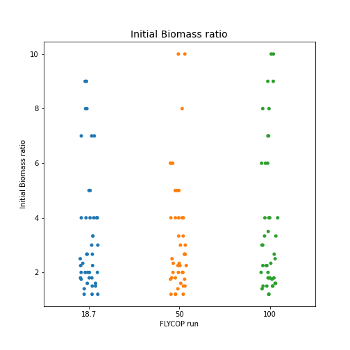{width=50%}
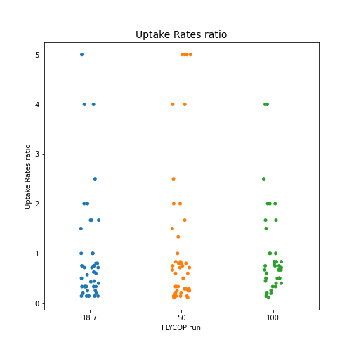{width=50%}

## 1.2. Final Biomass concentration {#NLim_M9_finalb}

* **Final *E.coli* biomass** was higher, the higher the initial value of [$NH_{4}$]. While for initial [$NH_{4}$] = 18.7 mM, the highest values were around 1.5-2.0 gL^-1^; for initial [$NH_{4}$] = 50 mM, they came up to around 4.0 gL^-1^; and for initial [$NH_{4}$] = 100 mM, up to 6.0 gL^-1^. It is worth noticing that for [$NH_{4}$] = 100 mM, there were very few values between 1.0 and 5.0 gL^-1^: the points concentrated either below or either above this interval.

* The same effect was observed **for *P.putida KT* biomass**. While for initial [$NH_{4}$] = 18.7 mM, the highest values were around 2.0 gL^-1^; for initial [$NH_{4}$] = 50 mM, they came up to around 6.0 gL^-1^; and for initial [$NH_{4}$] = 100 mM, up to nearly 8.0 gL^-1^. However, most of the points for these last two FLYCOP runs ([$NH_{4}$] = 50, 100 mM) ranged from 0 to ~5.0 gL^-1^.

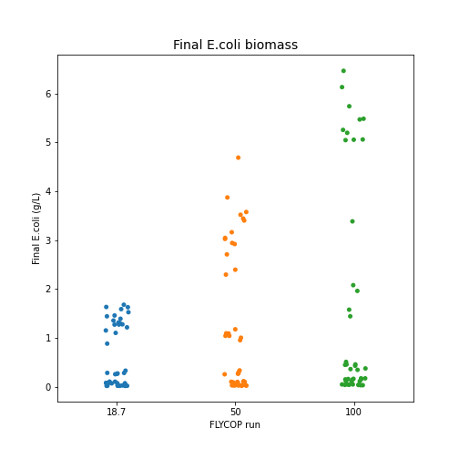{width=50%}
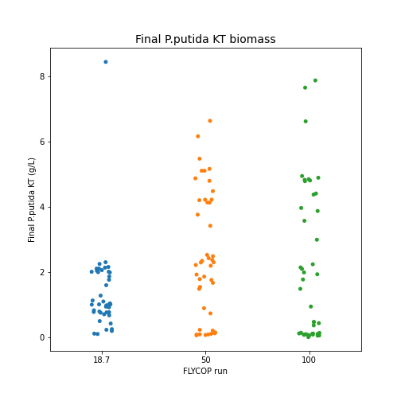{width=50%}

## 1.3. Final Product concentration {#NLim_M9_finalp}

* **Final naringenin concentration** displayed several outliers in all three FLYCOP runs, with disproportionate values above 100 mM. Apart from these, all three runs produced the same range of final naringenin values, from near 0 to 100 mM. It is worth noticing that, for [$NH_{4}$] = 18.7 mM, most of the points were concentrated under 50 mM, with a small group between 75 to 100 mM. In turn, for [$NH_{4}$] = 50 mM, the upper limit for the main cloud of points was around 75 mM (slightly higher). Finally, for [$NH_{4}$] = 100 mM, this upper limit for the main cloud of points (which seemed more clustered) was around 55 to 60 mM.

* **Final pCA concentration** tended to be 0 for most of the values in the three FLYCOP runs considered. However, for those values that were not 0, an effect was observed: the higher the initial [$NH_{4}$] concentration, the higher the final pCA value.

  - 8 of these points were found for initial [$NH_{4}$] = 18.7 mM; as high as 15-20 mM.
  - 10 of these points were found for initial [$NH_{4}$] = 50 mM; as high as 30-35 mM.
  - 7 of these points were found for initial [$NH_{4}$] = 100 mM; as high as 35-40 mM.

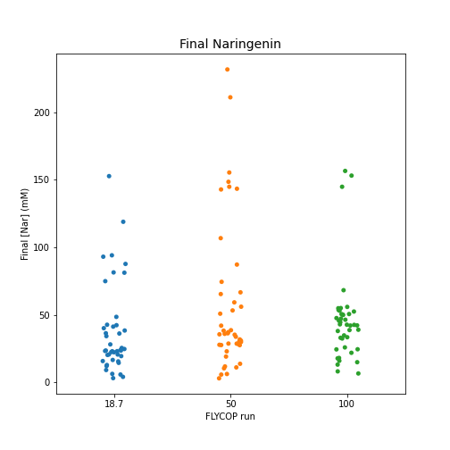{width=50%}
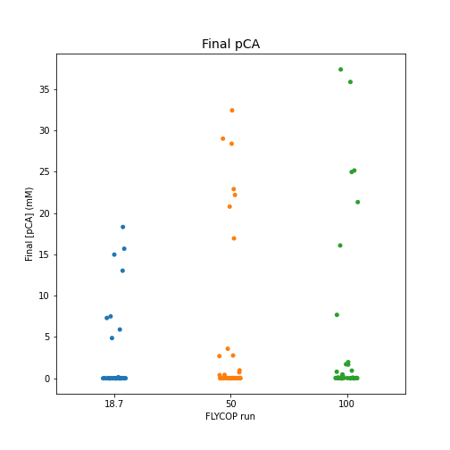{width=50%}

## 1.4. Final Nutrients concentration (N, P) {#NLim_M9_finalnut}

* With respect to **final [$NH_{4}$] concentrations**, for all three FLYCOP configurations there were a group of values of final [$NH_{4}$] = 0 mM; and a more dispersed group of points whose upper limit was around the respective initial [$NH_{4}$] value for each FLYCOP run. It is interesting to consider the final [$NH_{4}$] values equivalent to 0 for each FLYCOP run.

  - [$NH_{4}$] = 18.7 mM. 31 in 43.
  - [$NH_{4}$] = 50 mM. 22 in 44.
  - [$NH_{4}$] = 100 mM. 9 in 42.
  
As seen in these values, the higher the initial [$NH_{4}$] concentration, the lower the final [$NH_{4}$] values = 0 mM.
  
* With respect to **final $P_{i}$ concentrations**, the values obtained within the different FLYCOP runs were the following ones.
  
  * **Configuration:  18.7 mM [NH4]**
    - The number of low final [Pi] (under 1 mM) was:  32 in 43.
    - The number of intermediate final [Pi] (10-55 mM) was:  2 in 43.
    - The number of final [Pi] near original concentration (55-69.9 mM) was:  3 in 43.
    - The number of higher than initial or disproportionate final [Pi] (higher than 69.9 mM) was:  6 in 43. In these 6 cases, final [$NH_{4}$] ~ 0 mM.
    - The number of final [Pi] nearly 0 with final [nh4] nearly 0 was:  21 in 43. \newline

  * **Configuration:  50 mM [NH4]**
    - The number of low final [Pi] (under 1 mM) was:  26 in 44.
    - The number of intermediate final [Pi] (10-55 mM) was:  4 in 44.
    - The number of final [Pi] near original concentration (55-69.9 mM) was:  6 in 44.
    - The number of higher than initial or disproportionate final [Pi] (higher than 69.9 mM) was:  8 in 44. In these 8 cases, final [$NH_{4}$] ~ 0 mM.
    - The number of final [Pi] nearly 0 with final [nh4] nearly 0 was:  10 in 44. \newline

  * **Configuration:  100 mM [NH4]**
    - The number of low final [Pi] (under 1 mM) was:  27 in 42.
    - The number of low final [Pi] (between 1 to 10 mM) was:  2 in 42.
    - The number of intermediate final [Pi] (10-55 mM) was:  2 in 42.
    - The number of final [Pi] near original concentration (55-69.9 mM) was:  9 in 42.
    - The number of higher than initial or disproportionate final [Pi] (higher than 69.9 mM) was:  2 in 42. In these 2 cases, final [$NH_{4}$] ~ 0 mM.
    - The number of final [Pi] nearly 0 with final [nh4] nearly 0 was:  3 in 42. \newline


In general, the main three aspects to be considered were: i) the number of configurations with very low final $P_{i}$ or 0 did slightly decrease from the FLYCOP run [$NH_{4}$] = 18.7 mM, to the FLYCOP runs [$NH_{4}$] = 50, 100 mM; ii) the number of configurations with final disproportionate (or higher than initially) $P_{i}$ concentrations were notably higher in the FLYCOP runs [$NH_{4}$] = 18.7, 50 mM than in [$NH_{4}$] = 100 mM; iii) the higher the initial [$NH_{4}$] concentrations, the lower the number of configurations with [$NH_{4}$] ~ 0 mM, that also had [$P_{i}$] ~ 0.

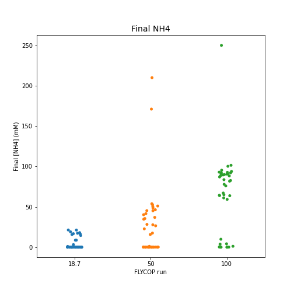{width=50%}
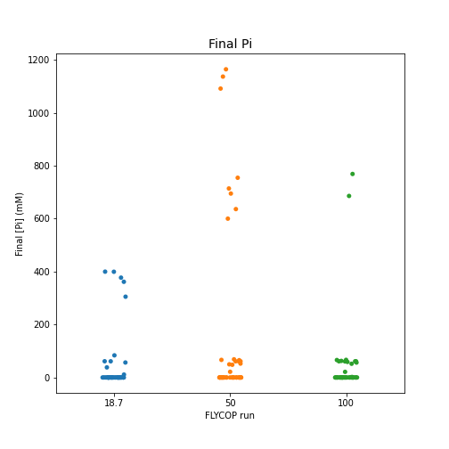{width=50%}

## 1.5. Conclusion and Further Implementing {#NLim_M9_conc}

* Regardless of the initial [$NH_{4}$] concentration, the **ratios for the optimal input parameters** (initial biomass, uptake rates) seemed to converge for the three FLYCOP runs. 

  - **Initial Biomass ratio** (*E.coli* / *P.putida*) points clustered between 0.5 to 3.0-4.0.
  - **Uptakes Rates ratio** (sucrose / fructose) points clustered under 1.0.

* The initial [$NH_{4}$] concentration conditioned the final biomass concentrations reached: the higher this initial concentration, the higher the final *E.coli* and *P.putida* biomass. This was an expected effect, since $NH_{4}$ is an essential nutrient for biomass growth.

* **Final naringenin concentration** did not vary substantially (in special, those final values within proportional limits) between the three FLYCOP runs considered.

* However, interestingly, **final pCA concentration** did vary between the three FLYCOP runs: this effect might be related to the higher final *E.coli* biomass values, the higher the initial [$NH_{4}$] concentration. Nevertheless, this issue raises the question of why this same effect was not observed for the case of *P.putida* and naringenin, since final *P.putida* biomass did also vary between the different FLYCOP runs.

  A potential explanation (to be further check) is that *P.putida* would not be as dependent as *E.coli* on [$NH_{4}$] for biomass growth.

* As expected for **nitrogen limitations**, the higher the initial [$NH_{4}$], the higher the final [$NH_{4}$] concentration.

* With respect to **final [$P_{i}$] values**, the global number of complete $P_{i}$ consumption was more or less similar for all three FLYCOP runs (slightly higher for [$NH_{4}$] = 18.7 mM). 

  - However, the number of configurations with disproportionate final [$P_{i}$] was notably higher for the FLYCOP runs with [$NH_{4}$] = 18.7, 50 mM. In all cases of disproportionate final values of phosphate, $NH_{4}$ had been exhausted.
  - Similarly, the number of configurations with final [$P_{i}$] near 0, having [$NH_{4}$] ~ 0, did substantially decrease as the initial [$NH_{4}$] increased.
  
  Thus there might be an interaction effect, to be further check, between nitrogen exhaustion and $P_{i}$ final levels (more frequently, consumption; in some cases, overproduction). \newline
  
With these **preliminary conclusions**, the further implementation headed for: a) determining the influence of sucrose limitation in this nitrogen limited consortium, b) considering this potential interaction between $NH_{4}$ and $P_{i}$ levels (notice that 69.9 mM [$P_{i}$] might also be limiting to some extent).

To the analysis, further utilities were added, namely:

* **Biomass Death Tracking**: considering whether there is loss of one or both microbes within each individual simulation, and where appropriate, in which cycle it starts.
* **$P_{i}$ Overconsumption Tracking**: considering cases of $P_{i}$ overconsumption in a few cycles time, and where appropriate, when this effect starts. *`r colorize("Pendiente implementar", "red")`*.


\newpage
# 2. Multiple Comparative Analysis for N limitations with M9-medium, without sucrose limitation {#NLim_M9_nonSucr}

For this second comparative analysis, the FLYCOP runs considered had 69.9 mM $P_{i}$ and 1000 mM sucrose as initial concentrations. They just differed on the initial $NH_{4}$ concentration.

- **M9base**: 18.7 mM [$NH_{4}$]. 77 configurations within the SD restriction criterion.
- **M950N**: 50 mM [$NH_{4}$]. 77 configurations within the SD restriction criterion.
- **M9100N**: 100 mM [$NH_{4}$]. 43 configurations within the SD restriction criterion.
- **M9200N**: 200 mM [$NH_{4}$]. 30 configurations within the SD restriction criterion.
	
It is worth noticing that the number of final configurations evaluated for the FLYCOP runs *M9base* and *M950N* were notably more abundant than for *M9100N* and specially for *M9200N*. \newline
	
On the other hand, the **dependent variables considered** in this comparative analysis were the following.
  
- Uptake Rates ratio (sucrose by *E.coli* / fructose by *P.putida*)
- Initial Biomass ratio (*E.coli* / *P.putida*)
- Final Product concentration (p-coumarate, naringenin).
- Final Biomass concentration (*E.coli*, *P.putida*).
- Final nutrient concentration ($NH_{4}$, $P_{i}$).
- Final sucrose concentration.
- Death Effect (if present): initial cycle where it started.
	
	
## 2.1. Input Parameters ratios {#NLim_M9_nonSucr_inputpar}

* The ratio for **initial biomass** (*E.coli*/*P.putida*) seemed similar for all four configurations, as shown in the scatterplot on the left. The cloud of points ranged from a lower limit of around 0.5 to an upper limit of 9 to 10. However, most of the values for the FLYCOP runs were concentrated under the value of 4.

* Again, the ratio for **uptake rates** (sucrose / fructose) seemed similar for all four configurations, as shown in the scatterplot on the right. The cloud of points ranged from a lower limit near 0 to an upper limit of 5. However, most of the values for the FLYCOP runs were concentrated under the value of 1.0. For the run [$NH_{4}$] = 200 mM, the clustering of points under 1.0 was smaller, but this might be also due to the reduced number of configurations (points) evaluated for this run.

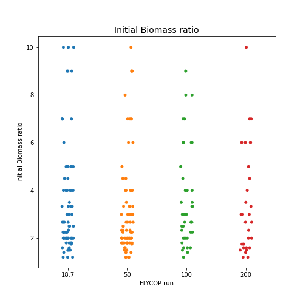{width=50%}
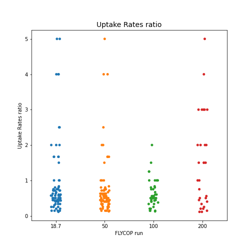{width=50%}

## 2.2. Final Biomass concentration {#NLim_M9_nonSucr_finalb}	

* **Final *E.coli* biomass** tended to be higher, the higher the initial value of [$NH_{4}$]. For initial [$NH_{4}$] = 18.7 mM, the points clustered between 1.0-2.2 gL^-1^; while for initial [$NH_{4}$] = 50 mM, they were concentrated between 2.5-5.0 gL^-1^.  However, in the cases of [$NH_{4}$] = 100, 200 mM, final *E.coli* biomass ranged from lower values around 1.0 to upper values around 8.0 gL^-1^.

* The same effect was observed **for *P.putida KT* biomass**. While for initial [$NH_{4}$] = 18.7 mM, the highest values were around 1.0-1.2 gL^-1^; for initial [$NH_{4}$] = 50 mM, they came up to around 2.0-2.5 gL^-1^. At the same time, final *P.putida* values for [$NH_{4}$] = 100, 200 mM ranged from the same lower value than the two previous FLYCOP runs, to around 6.0 gL^-1^ as the upper limit.

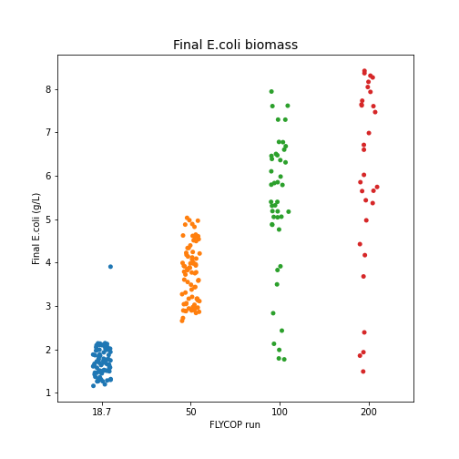{width=50%}
{width=50%}

## 2.3. Final Product concentration {#NLim_M9_nonSucr_finalp}

* As for **final naringenin concentration**, in the first FLYCOP run ([$NH_{4}$] = 18.7 mM) the cloud of points clustered between 0 to around 60 mM. At the same time, for runs [$NH_{4}$] = 50, 100 mM; the respective clouds of points ranged from 0 to around 130 mM; with some higher outliers. Finally, for the case [$NH_{4}$] = 200 mM, the cloud of points was similar to the two previous ones, but with less concentration of points between 50 and 125 mM.

* As for **final pCA concentration**, this value was 0 or near 0 for an important number of configurations in all FLYCOP runs. However, it was slightly lower for the last FLYCOP run (higher initial [$NH_{4}$]).

  - [$NH_{4}$] = 18.7 mM: 36 in 77 values (47%).
  - [$NH_{4}$] = 50 mM: 44 in 77 values (57%).
  - [$NH_{4}$] = 100 mM: 21 in 43 values (49%).
  - [$NH_{4}$] = 200 mM: 9 in 30 values (30%).

  The rest of the values for each run ranged from 0 to a different upper limit.

  - [$NH_{4}$] = 18.7 mM: upper limit around 60 mM.
  - [$NH_{4}$] = 50, 100, 200 mM: upper limit around 100 mM. Certain outliers for [$NH_{4}$] ~ 200 mM.


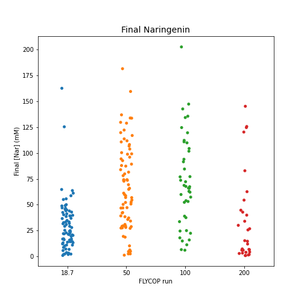{width=50%}
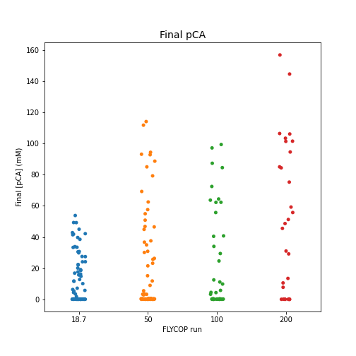{width=50%}

## 2.4. Final Nutrients concentration (N, P) {#NLim_M9_nonSucr_finalnut}

With respect to **final [$NH_{4}$] concentrations**, the distribution of points was as follows.

  - [$NH_{4}$] = 18.7 mM. 76 in 77 values, 0 or near 0 mM. 1 outlier (~150 mM).
  - [$NH_{4}$] = 50 mM. 77 in 77 values, 0 or near 0 mM.
  - [$NH_{4}$] = 100 mM. 26 in 43. The rest of points were distributed between 0 to around 60 mM.
  - [$NH_{4}$] = 200 mM. 10 in 30. The rest of points were distributed between 0 to around 140-150 mM.
  
As seen in these values, the higher the initial [$NH_{4}$] concentration, the lower the final [$NH_{4}$] values = 0 mM. \newline
  
With respect to **final $P_{i}$ concentrations**, the values obtained within the different FLYCOP runs were the following ones.

* **Configuration:  18.7 mM [NH4]**:

  - The number of low final [Pi] (under 1 mM) was:  48 in 77 (62%).
  - The number of low final [Pi] (between 1 to 10 mM) was:  6 in 77.
  - The number of intermediate final [Pi] (10-55 mM) was:  15 in 77.
  - The number of final [Pi] near original concentration (55-69.9 mM) was:  3 in 77.
  - The number of higher than initial or disproportionate final [Pi] (higher than 69.9 mM) was: 5 in 77.
  - The number of final disproportionate [Pi] with final [nh4] nearly 0 was: 5 in 77.
  - The number of final [Pi] nearly 0 with final [nh4] nearly 0 was:  48 in 77. \newline

* **Configuration:  50 mM [NH4]**:

  - The number of low final [Pi] (under 1 mM) was:  62 in 77 (80%).
  - The number of low final [Pi] (between 1 to 10 mM) was:  2 in 77.
  - The number of intermediate final [Pi] (10-55 mM) was:  4 in 77.
  - The number of final [Pi] near original concentration (55-69.9 mM) was:  3 in 77.
  - The number of higher than initial or disproportionate final [Pi] (higher than 69.9 mM) was:  6 in 77.
  - The number of final disproportionate [Pi] with final [nh4] nearly 0 was:  6 in 77.
  - The number of final [Pi] nearly 0 with final [nh4] nearly 0 was:  62 in 77. \newline

* **Configuration:  100 mM [NH4]**:

  - The number of low final [Pi] (under 1 mM) was:  20 in 43 (46%).
  - The number of low final [Pi] (between 1 to 10 mM) was:  9 in 43.
  - The number of intermediate final [Pi] (10-55 mM) was:  2 in 43.
  - The number of final [Pi] near original concentration (55-69.9 mM) was:  9 in 43.
  - The number of higher than initial or disproportionate final [Pi] (higher than 69.9 mM) was:  3 in 43.
  - The number of final disproportionate [Pi] with final [nh4] nearly 0 was:  3 in 43.
  - The number of final [Pi] nearly 0 with final [nh4] nearly 0 was:  17 in 43. \newline

* **Configuration:  200 mM [NH4]**:

  - The number of low final [Pi] (under 1 mM) was:  16 in 30 (53%).
  - The number of low final [Pi] (between 1 to 10 mM) was:  4 in 30.
  - The number of intermediate final [Pi] (10-55 mM) was:  1 in 30.
  - The number of final [Pi] near original concentration (55-69.9 mM) was:  5 in 30.
  - The number of higher than initial or disproportionate final [Pi] (higher than 69.9 mM) was:  4 in 30.
  - The number of final disproportionate [Pi] with final [nh4] nearly 0 was:  0 in 30.
  - The number of final [Pi] nearly 0 with final [nh4] nearly 0 was:  10 in 30. \newline
  
It is interesting to note that for runs with initial [$NH_{4}$] = 18.7, 50 mM, the number of final values with [$P_{i}$] under 1 mM or 0 was higher (in proportion) than for runs with initial [$NH_{4}$] = 100, 200 mM. In particular, in all of these cases where $P_{i}$ was finally exhausted in the first two runs, $NH_{4}$ was also exhausted. However, this effect of coupled final exhaustion of both nutrients ($P_{i}$ exhausted, with $NH_{4}$ exhausted) happened with an inferior frequency for the last two runs with higher initial [$NH_{4}$]. \newline

  - **[$NH_{4}$] = 18.7 mM**. Number of final [pi] ~ 0 mM: 48 in 77. Number of final [pi] ~ 0 mM with final [nh4] ~ 0 mM: 48 in 77. 100% of cases with final [pi] ~ 0 mM implied final [nh4] ~ 0 mM (48/48).
  
  - **[$NH_{4}$] = 50 mM**. Number of final [pi] ~ 0 mM: 62 in 77. Number of final [pi] ~ 0 mM with final [nh4] ~ 0 mM: 62 in 77. 100% of cases with final [pi] ~ 0 mM implied final [nh4] ~ 0 mM (62/62).
  
  - **[$NH_{4}$] = 100 mM**. Number of final [pi] ~ 0 mM: 20 in 43. Number of final [pi] ~ 0 mM with final [nh4] ~ 0 mM: 17 in 43. 85% of cases with final [pi] ~ 0 mM implied final [nh4] ~ 0 mM (17/20).
  
  - **[$NH_{4}$] = 200 mM**. Number of final [pi] ~ 0 mM: 16 in 30. Number of final [pi] ~ 0 mM with final [nh4] ~ 0 mM: 10 in 30. 62.5% of cases with final [pi] ~ 0 mM implied final [nh4] ~ 0 mM (10/16). \newline
  
  
At the same time, all those (unfrequent cases) of $P_{i}$ overproduction for the first three runs happened under $NH_{4}$ exhaustion. However, this same situation did not happen for the run with initial [$NH_{4}$] = 200 mM. \newline

  - **[$NH_{4}$] = 18.7 mM**. Number of final [pi] > 69.9 mM: 5 in 77. Number of final [pi] > 69.9 mM with final [nh4] ~ 0 mM: 5 in 77. 100% of cases with final [pi] > 69.9 mM implied final [nh4] ~ 0 mM (5/5).
  
  - **[$NH_{4}$] = 50 mM**. Number of final [pi] > 69.9 mM: 6 in 77. Number of final [pi] > 69.9 mM with final [nh4] ~ 0 mM: 6 in 77. 100% of cases with final [pi] > 69.9 mM implied final [nh4] ~ 0 mM (6/6).
  
  - **[$NH_{4}$] = 100 mM**. Number of final [pi] ~ 0 mM: 3 in 43. Number of final [pi] ~ 0 mM with final [nh4] ~ 0 mM: 3 in 43. 100% of cases with final [pi] ~ 0 mM implied final [nh4] ~ 0 mM (3/3).
  
  - **[$NH_{4}$] = 200 mM**. Number of final [pi] > 69.9 mM: 4 in 30. Number of final [pi] > 69.9 mM with final [nh4] ~ 0 mM: 0 in 30. 0% of cases with final [pi] > 69.9 mM implied final [nh4] ~ 0 mM (0/4).

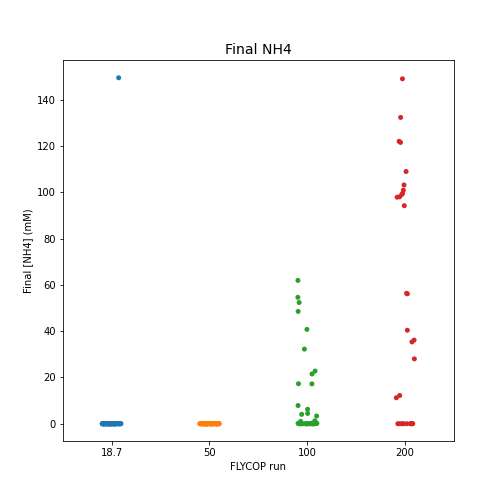{width=50%}
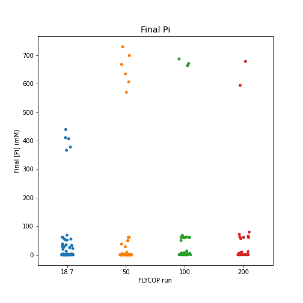{width=50%}


## 2.5. Final sucrose concentration {#NLim_M9_nonSucr_finalsucr}

**Final sucrose concentration** ranged from 1000 to 600-550 mM for the first FLYCOP run (18.7 mM [$NH_{4}$]). In the rest of FLYCOP runs, this final concentration ranged from 1000 to 0 mM, with more values of final sucrose in 0 in the last two cases ([$NH_{4}$] = 100, 200 mM): 12 in 43, and 5 in 30 values, respectively. These final 0-sucrose cases happened more frequently for the highest fitness values in both cases.

## 2.6. Death Effect (initial cycle) {#NLim_M9_nonSucr_deathinit}

For those cases where the *death effect* happened within each FLYCOP run, the higher the initial [$NH_{4}$] concentration, the later this effect started (lower limit of the range of values for each FLYCOP run).

  - [$NH_{4}$] = 18.7 mM. Lower limit around cycle 25, main cloud of points between cycles 25 and 50.
  - [$NH_{4}$] = 50 mM. Lower limit around cycle 40, main cloud of points between cycles 40 and 60-70.
  - [$NH_{4}$] = 100 mM. Lower limit around cycle 50, main cloud of points between cycles 50 and 100.
  - [$NH_{4}$] = 200 mM. Lower limit around cycle 60, main cloud of points between cycles 60 to 160 (more dispersed group).
  
Moreover, the number of cases **without death effect** for each FLYCOP run was the following.

  - [$NH_{4}$] = 18.7 mM. 2 in 77 (~3%).
  - [$NH_{4}$] = 50 mM. 3 in 77 (~4%).
  - [$NH_{4}$] = 100 mM. 11 in 43 (~26%).
  - [$NH_{4}$] = 200 mM. 10 in 30 (~33%).

As expected, the higher the initial [$NH_{4}$] concentration, the higher the number of configurations without final death effect. Moreover, it is interesting to check what had happened with $NH_{4}$ and $P_{i}$ in those cases with final death effect.

* **[$NH_{4}$] = 18.7 mM**. 

    * The number of cases with death effect was:  75 in 77 (**97%**).
    * The number of cases with death effect and [nh4] exhaustion was:  75 in 77 (75/75, **100% of cases** with death effect).
    * The number of cases with death effect and both [nh4] and [pi] exhaustion was:  48 in 77 (48/75, 64% of cases with death effect).
    
* **[$NH_{4}$] = 50 mM**.

    * The number of cases with death effect was:  74 in 77 (**96%**).
    * The number of cases with death effect and [nh4] exhaustion was:  74 in 77 (74/74, **100% of cases** with death effect).
    * The number of cases with death effect and both [nh4] and [pi] exhaustion was:  62 in 77 (62/74, 84% of cases with death effect).
    
* **[$NH_{4}$] = 100 mM**.

    * The number of cases with death effect was:  32 in 43 (**74%**).
    * The number of cases with death effect and [nh4] exhaustion was:  21 in 43 (21/32, **66% of cases** with death effect).
    * The number of cases with death effect and both [nh4] and [pi] exhaustion was:  17 in 43 (17/32, 53% of cases with death effect).
    
* **[$NH_{4}$] = 200 mM**.

    * The number of cases with death effect was:  20 in 30 (**66%**).
    * The number of cases with death effect and [nh4] exhaustion was:  10 in 30 (10/20, **50% of cases** with death effect).
    * The number of cases with death effect and both [nh4] and [pi] exhaustion was:  10 in 20 (50% of cases with death effect). \newline
    
The main conclusions in this respect would be: i) the lower the initial [$NH_{4}$] concentration, the higher the final number of configurations with death effect; ii) $NH_{4}$ exhaustion happened in all cases of death effect for the first two FLYCOP runs (lower initial $NH_{4}$ values), and in an important number of cases for the last two FLYCOP runs (higher initial $NH_{4}$ values); iii) in a very notable number of these configurations with death effect and $NH_{4}$ exhaustion, there was also final $P_{i}$ exhaustion.

An unresolved issue, however, would be determining what was the cause for death effect in those configurations where final $NH_{4}$ was not exhausted (i.e. in special, in the last two FLYCOP runs, [$NH_{4}$] = 100, 200 mM). A potential reason to be further checked, nearly exhausted final $NH_{4}$ levels, together with insufficient $P_{i}$ levels.
    

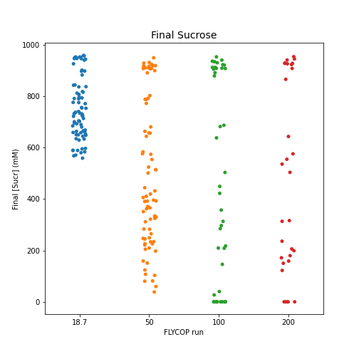{width=50%}
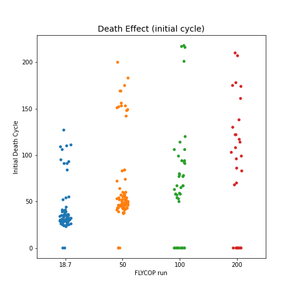{width=50%}

## 2.7. Conclusion and Further Implementing {#NLim_M9_nonSucr_conc}

* Regardless of the initial [$NH_{4}$] concentration, the **ratios for the optimal input parameters** (initial biomass, uptake rates) seemed to converge for the different FLYCOP runs. 

  - **Initial Biomass ratio** (*E.coli* / *P.putida*) points clustered between 0.5 to 3.0-4.0.
  - **Uptakes Rates ratio** (sucrose / fructose) points clustered under 1.0.

* The initial [$NH_{4}$] concentration conditioned the **final biomass concentrations** reached: the higher this initial concentration, the higher the final *E.coli* and *P.putida* biomass. This was an expected effect, since $NH_{4}$ is an essential nutrient for biomass growth.

* **Final naringenin concentration ranges** were similar for the FLYCOP runs with initial [$NH_{4}$] = 50, 100, 200 mM (upper limit higher than 100 mM). At the same time, the upper limit for the first run ([$NH_{4}$] = 18.7 mM) was around 60 mM. In any case, it might not be reasonable achieving a very high final naringenin concentrations (above 30 to 50 mM), so these differences could not be considered significant.

* The same effect was observed for **final pCA concentrations**: a higher upper limit (around 100 mM) for the FLYCOP runs with initial [$NH_{4}$] = 50, 100, 200 mM; than for the first run ([$NH_{4}$] = 18.7 mM), around 60 mM. At the same time, it is worth noticing that the number of cases of final pCA near 0 mM was slightly inferior for the last FLYCOP run ([$NH_{4}$] = 200 mM) than for the first ones.

  This last issue would make sense, since the higher the initial [$NH_{4}$], the higher the final *E.coli* biomass; and thus the higher the final [pCA] which the mentioned microbe can produce.

* As expected for **nitrogen limitations**, the higher the initial [$NH_{4}$], the higher the final [$NH_{4}$] concentration.

* With respect to **final [$P_{i}$] values**, the number of cases with full $P_{i}$ consumption was moderately higher for FLYCOP runs [$NH_{4}$] = 18.7, 50 mM than for [$NH_{4}$] = 100, 200 mM.

  - Moreover, the number of configurations with final [$P_{i}$] near 0, having [$NH_{4}$] ~ 0, did notably decrease as the initial [$NH_{4}$] increased.
  - At the same time, no configurations with disproportionate final [$P_{i}$] (or higher than initially) were observed for the FLYCOP run [$NH_{4}$] = 200 mM, even though they did happen for the other three runs.
  
  Thus there might be an interaction effect, to be further check, between nitrogen exhaustion and $P_{i}$ final levels (more frequently, consumption; in some cases, overproduction).
  
* **Sucrose consumption** was more pronounced in those FLYCOP runs with lighter nitrogen limitations ([$NH_{4}$] = 50, 100, 200 mM). It is suspected that those configurations with higher sucrose consumption do have a higher fitness, though this hypothesis should be further evaluated.
  
* With respect to the **death effect**, the higher the initial [$NH_{4}$] concentration, the later this phenomenon started. However, there were configurations in every FLYCOP run where it did not happen. Again, the higher the initial [$NH_{4}$] concentration, the higher the number of configurations with no final death effect. \newline

To sum up, this second series of comparative analysis contributed to **further validate the following hypothesis**.

* **Sucrose limitation** would not be the main cause for microbes death. However, under N and /or P limitations, sucrose consumption would be increased.

* **Nitrogen limitation** might be the main cause for microbes death, but there might also be an interaction with **phosphate limitation**, as shown in the data values obtained in the analysis for the death effect (initial cycle).
  

\newpage
# 3. Multiple Comparative Analysis for N limitations with M9-medium, without sucrose / $P_{i}$ limitations. {#NLim_M9_nonSucr_nP}

For this third comparative analysis, the FLYCOP runs considered had 1000 mM $P_{i}$ and 1000 mM sucrose as initial concentrations. They just differed on the initial $NH_{4}$ concentration.

- **M9base**: 18.7 mM [$NH_{4}$]. 70 configurations within the SD restriction criterion.
- **M950N**: 50 mM [$NH_{4}$]. 75 configurations within the SD restriction criterion.
- **M9100N**: 100 mM [$NH_{4}$]. 48 configurations within the SD restriction criterion.
- **M9200N**: 200 mM [$NH_{4}$]. 55 configurations within the SD restriction criterion.
	
It is worth noticing that the number of final configurations evaluated for the FLYCOP runs *M9base* and *M950N* were moderately more abundant than for *M9100N* and *M9200N*. \newline
	
On the other hand, the **dependent variables considered** in this comparative analysis were the following.
  
- Uptake Rates ratio (sucrose by *E.coli* / fructose by *P.putida*)
- Initial Biomass ratio (*E.coli* / *P.putida*)
- Final Product concentration (p-coumarate, naringenin).
- Final Biomass concentration (*E.coli*, *P.putida*).
- Final nutrient concentration ($NH_{4}$, $P_{i}$).
- Final sucrose concentration.
- Death Effect (if present): initial cycle where it started.
- $P_{i}$ Overconsumption Effect (if present): initial cycle where it started and duration. *Overconsumption here considered as* > 10.0 mM $P_{i}$ / cycle. *`r colorize("Pendiente implementar", "red")`*.
	
	
## 3.1. Input Parameters ratios {#NLim_M9_nonSucr_nP_inputpar}

* The ratio for **initial biomass** (*E.coli*/*P.putida*) seemed similar for all four configurations, as shown in the scatterplot on the left. The cloud of points ranged from a lower limit of around 0.5 to an upper limit of 10. However, an important number of the values for the FLYCOP runs were concentrated under the value of 4.

* Again, the ratio for **uptake rates** (sucrose / fructose) seemed similar for all four configurations, as shown in the scatterplot on the right. The cloud of points ranged from a lower limit near 0 to an upper limit of 4 to 5. However, most of the values for the FLYCOP runs were concentrated under the value of 1.0.

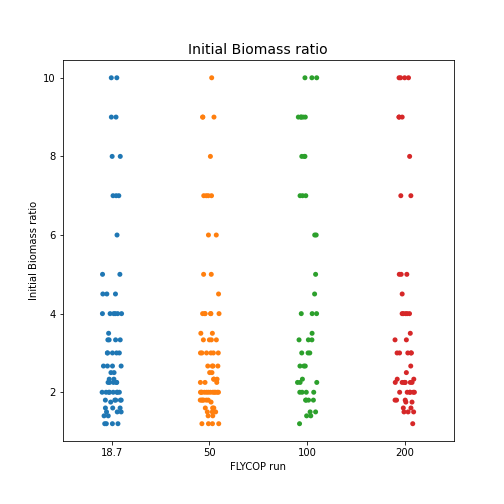{width=50%}
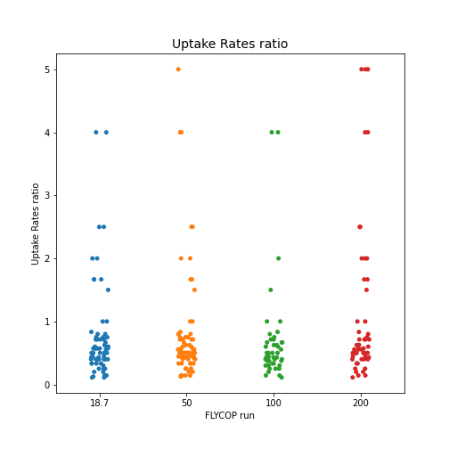{width=50%}

## 3.2. Final Biomass concentration {#NLim_M9_nonSucr_nP_finalb}	

* **Final *E.coli* biomass** tended to be higher, the higher the initial value of [$NH_{4}$]. For initial [$NH_{4}$] = 18.7 mM, the points clustered between 1.0-2.2 gL^-1^; while for initial [$NH_{4}$] = 50 mM, they were concentrated between 2.5-5.0 gL^-1^.  However, in the cases of [$NH_{4}$] = 100, 200 mM, final *E.coli* biomass ranged from lower values around 1.0 to upper values around 8.0 gL^-1^.

* The same effect was observed **for *P.putida KT* biomass**. While for initial [$NH_{4}$] = 18.7 mM, the highest values were around 1.0-1.2 gL^-1^; for initial [$NH_{4}$] = 50 mM, they came up to around 2.0-2.5 gL^-1^. At the same time, final *P.putida* values for [$NH_{4}$] = 100, 200 mM ranged from the same lower value than the two previous FLYCOP runs, to around 5.0-6.0 gL^-1^ as the upper limit.

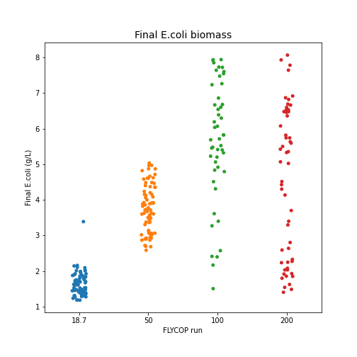{width=50%}
{width=50%}

## 3.3. Final Product concentration {#NLim_M9_nonSucr_nP_finalp}

* As for **final naringenin concentration**, in the first FLYCOP run ([$NH_{4}$] = 18.7 mM) the cloud of points clustered between 0 to around 60 mM. At the same time, for runs [$NH_{4}$] = 50, 100 mM; the respective clouds of points ranged from 0 to around 150 mM; with some higher outliers for [$NH_{4}$] = 100 mM. Finally, for the case [$NH_{4}$] = 200 mM, the cloud of points was similar to the two previous ones, but with an upper limit around 180-190 mM, and with a slightly reduced concentration of points in the higher half.

* As for **final pCA concentration**, this value was 0 or near 0 for an important number of configurations in all FLYCOP runs. However, it was slightly lower for the last FLYCOP runs (higher initial [$NH_{4}$]).

  - [$NH_{4}$] = 18.7 mM: 40 in 70 values (57%).
  - [$NH_{4}$] = 50 mM: 42 in 75 values (56%).
  - [$NH_{4}$] = 100 mM: 22 in 48 values (46%).
  - [$NH_{4}$] = 200 mM: 23 in 55 values (42%).

  The rest of the values for each run ranged from 0 to a different upper limit.

  - [$NH_{4}$] = 18.7 mM: upper limit around 50 mM.
  - [$NH_{4}$] = 50, 100 mM: upper limit around 80-100 mM, with some outliers for each case.
  - [$NH_{4}$] = 200 mM: upper limit around 160 mM.

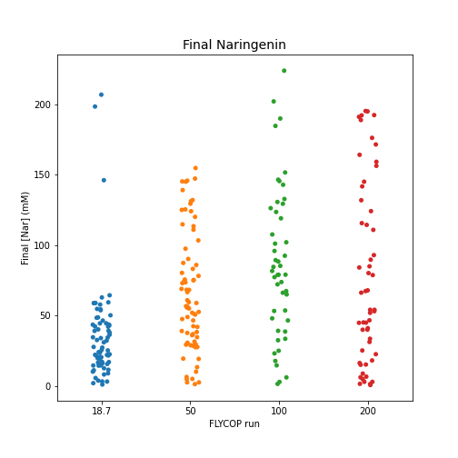{width=50%}
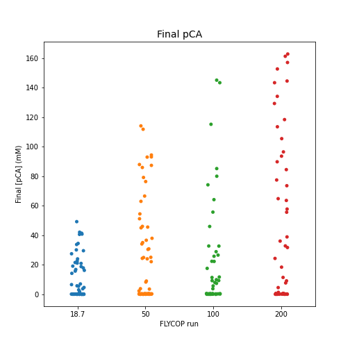{width=50%}


## 3.4. Final Nutrients concentration (N, P) {#NLim_M9_nonSucr_nP_finalnut}

With respect to **final [$NH_{4}$] concentrations**, the distribution of points was as follows.

  - [$NH_{4}$] = 18.7 mM. 69 in 70 values, 0 or near 0 mM. 1 outlier (~175 mM).
  - [$NH_{4}$] = 50 mM. 74 in 75 values, 0 or near 0 mM. 1 outlier (~175 mM).
  - [$NH_{4}$] = 100 mM. 32 in 48. The rest of points were distributed between 0 to around 50 mM. 1 outlier (~250 mM).
  - [$NH_{4}$] = 200 mM. 10 in 55. The rest of points were distributed between 0 to around 150 mM. 1 outlier (~350 mM).
  
As seen in these values, the higher the initial [$NH_{4}$] concentration, the lower the final [$NH_{4}$] values = 0 mM. \newline
  
With respect to **final $P_{i}$ concentrations**, the values obtained within the different FLYCOP runs were the following ones.

* **Configuration:  18.7 mM [NH4]**:

  - The number of low final [Pi] (under 1 mM) was:  0 in 70 (0%).
  - The number of low final [Pi] (between 1 to 10 mM) was:  0 in 70.
  - The number of intermediate final [Pi] (10-55 mM) was:  0 in 70.
  - The number of final [Pi] near original concentration (55-69.9 mM) was:  0 in 70.
  - The number of final [Pi] higher than 1000 mM was: 6 in 70 (9%). In **all** of these cases, final [$NH_{4}$] was 0 or nearly 0. \newline
  
* **Configuration:  50 mM [NH4]**:

  - The number of low final [Pi] (under 1 mM) was:  0 in 75 (0%).
  - The number of low final [Pi] (between 1 to 10 mM) was:  0 in 75.
  - The number of intermediate final [Pi] (10-55 mM) was:  0 in 75.
  - The number of final [Pi] near original concentration (55-69.9 mM) was:  0 in 75.
  - The number of final [Pi] higher than 1000 mM was: 6 in 75 (8%). In **all** of these cases, final [$NH_{4}$] was 0 or nearly 0. \newline
  
* **Configuration:  100 mM [NH4]**:

  - The number of low final [Pi] (under 1 mM) was:  0 in 48 (0%).
  - The number of low final [Pi] (between 1 to 10 mM) was:  0 in 48.
  - The number of intermediate final [Pi] (10-55 mM) was:  0 in 48.
  - The number of final [Pi] near original concentration (55-69.9 mM) was:  0 in 48.
  - The number of final [Pi] higher than 1000 mM was: 3 in 48 (6%). In **all** of these cases, final [$NH_{4}$] was 0 or nearly 0. \newline

* **Configuration:  200 mM [NH4]**:

  - The number of low final [Pi] (under 1 mM) was:  0 in 55 (0%).
  - The number of low final [Pi] (between 1 to 10 mM) was:  0 in 55.
  - The number of intermediate final [Pi] (10-55 mM) was:  0 in 55.
  - The number of final [Pi] near original concentration (55-69.9 mM) was:  0 in 55.
  - The number of final [Pi] higher than 1000 mM was: 3 in 55 (5%). In **none** of these cases, final [$NH_{4}$] was 0 or nearly 0. \newline
  

In this comparative analysis, since the initial [$P_{i}$] was 1000 mM, there were no final values under 69.9 mM in any FLYCOP run. However, in runs [$NH_{4}$] = 18.7, 50, 100 mM there were a certain number of configurations of $P_{i}$ production, and in all of them $NH_{4}$ had been exhausted. In run [$NH_{4}$] = 200 mM, there were also four cases of $P_{i}$ production, but without $NH_{4}$ being also exhausted.[$NH_{4}$] = 18.7

In general, the range of final $P_{i}$ values for each FLYCOP run was the following one.

  - [$NH_{4}$] = 18.7 mM. From 1000 to 700-750 mM.
  - [$NH_{4}$] = 50, 100, 200 mM. From 1000 to 500 mM, with some points between 500 and 350 mM for [$NH_{4}$] = 100 mM.

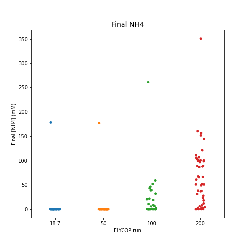{width=50%}
{width=50%}


## 3.5. Final sucrose concentration {#NLim_M9_nonSucr_nP_finalsucr}

**Final sucrose concentration** ranged from 1000 to 600-550 mM for the first FLYCOP run (18.7 mM [$NH_{4}$]). In the rest of FLYCOP runs, this final concentration ranged from 1000 to 0 mM, with more values of final sucrose in 0 in the last two cases ([$NH_{4}$] = 100, 200 mM): 14 in 48, and 31 in 55 values, respectively.

## 3.6. Death Effect (initial cycle) {#NLim_M9_nonSucr_nP_deathinit}

For those cases where the *death effect* happened within each FLYCOP run, the higher the initial [$NH_{4}$] concentration, the later this effect started (lower limit of the range of values for each FLYCOP run).

  - [$NH_{4}$] = 18.7 mM. Lower limit around cycle 25, main cloud of points between cycles 25 and 50. *Notable number of outliers*.
  - [$NH_{4}$] = 50 mM. Lower limit around cycle 40, main cloud of points between cycles 40 and 70-80. *Notable number of outliers*.
  - [$NH_{4}$] = 100 mM. Lower limit around cycle 50, main cloud of points between cycles 50 and 100. *Certain number of outliers*.
  - [$NH_{4}$] = 200 mM. Lower limit around cycle 60, two groups of points: intervals (60-70) and (140-180). \newline
  
Moreover, the number of cases **without death effect** for each FLYCOP run was the following.

  - [$NH_{4}$] = 18.7 mM. 3 in 70 (~4%).
  - [$NH_{4}$] = 50 mM. 1 in 75 (~1%).
  - [$NH_{4}$] = 100 mM. 8 in 48 (~17%).
  - [$NH_{4}$] = 200 mM. 16 in 55 (~29%). \newline

As expected, the higher the initial [$NH_{4}$] concentration, the higher the number of configurations without final death effect. Moreover, it is interesting to check what had happened with $NH_{4}$ and $P_{i}$ in those cases with final death effect.

* **[$NH_{4}$] = 18.7 mM**. 

    * The number of cases with death effect was:  67 in 70 (**96%**).
    * The number of cases with death effect and [nh4] exhaustion was:  67 in 70 (67/67, **100% of cases** with death effect).
    * The number of cases with death effect and both [nh4] and [pi] exhaustion was:  0 in 70.
    
* **[$NH_{4}$] = 50 mM**.

    * The number of cases with death effect was:  74 in 75 (**99%**).
    * The number of cases with death effect and [nh4] exhaustion was:  74 in 75 (74/74, **100% of cases** with death effect).
    * The number of cases with death effect and both [nh4] and [pi] exhaustion was:  0 in 75.
    
* **[$NH_{4}$] = 100 mM**.

    * The number of cases with death effect was:  40 in 48 (**83%**).
    * The number of cases with death effect and [nh4] exhaustion was:  26 in 48 (26/40, **65% of cases** with death effect).
    * The number of cases with death effect and both [nh4] and [pi] exhaustion was:  0 in 48.
    
* **[$NH_{4}$] = 200 mM**.

    * The number of cases with death effect was:  39 in 55 (**71%**).
    * The number of cases with death effect and [nh4] exhaustion was:  10 in 55 (10/39, **26% of cases** with death effect).
    * The number of cases with death effect and both [nh4] and [pi] exhaustion was:  0. \newline
    
The main conclusions in this respect would be: i) the lower the initial [$NH_{4}$] concentration, the higher the final number of configurations with death effect; ii) $NH_{4}$ exhaustion happened in all cases of death effect for the first two FLYCOP runs (lower initial $NH_{4}$ values), in an important number of cases for the third FLYCOP run, and in a moderate number of cases for the last FLYCOP run (highest initial $NH_{4}$); iii) in this case, $P_{i}$ was never finally exhausted, so there was not possible interaction between $NH_{4}$ and $P_{i}$ limitations.

An unresolved issue, however, would be determining what was the cause for death effect in those configurations where final $NH_{4}$ was not exhausted (i.e. in special, in the last FLYCOP runs, [$NH_{4}$] = 200 mM). A potential reason to be further checked, nearly exhausted or low final $NH_{4}$ levels with unbalanced (available) quantities of $P_{i}$ and/or carbon source.

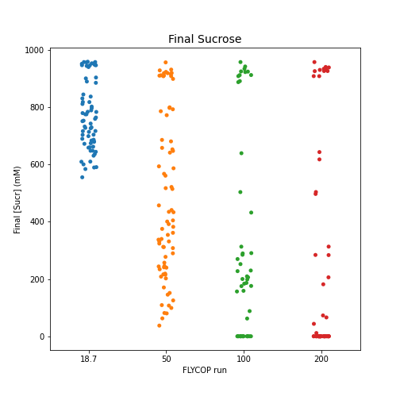{width=50%}
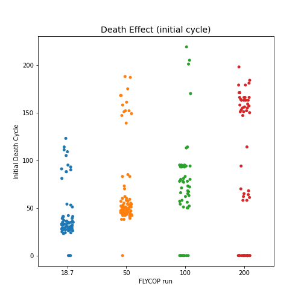{width=50%}

## 3.7. Conclusion and Further Implementing {#NLim_M9_nonSucr_nP_conc}

* Regardless of the initial [$NH_{4}$] concentration, the **ratios for the optimal input parameters** (initial biomass, uptake rates) seemed to converge for the different FLYCOP runs. 

  - **Initial Biomass ratio** (*E.coli* / *P.putida*) points clustered between 0.5 to 3.0-4.0.
  - **Uptakes Rates ratio** (sucrose / fructose) points clustered under 1.0.

* The initial [$NH_{4}$] concentration conditioned the **final biomass concentrations** reached: the higher this initial concentration, the higher the final *E.coli* and *P.putida* biomass. This was an expected effect, since $NH_{4}$ is an essential nutrient for biomass growth.

* **Final naringenin concentration ranges** were similar for the FLYCOP runs with initial [$NH_{4}$] = 50, 100, 200 mM (upper limit around 150 mM). At the same time, the upper limit for the first run ([$NH_{4}$] = 18.7 mM) was around 60 mM. In any case, it might not be reasonable achieving a very high final naringenin concentrations (above 30 to 50 mM), so these differences could not be considered significant.

* As for **final pCA concentrations**, the higher the initial [$NH_{4}$] concentration, the higher the final value of pCA. The upper limits in the respective clouds of points for the four FLYCOP runs were 60, 120, 120 and 160 mM. However, many of these values could be considered disproportionate above a certain concentration (30 to 50 mM). 

  On the other hand, there were also an important number of points with final pCA near 0 in all FLYCOP runs; interestingly, slightly higher in those runs with lower initial [$NH_{4}$] values. This last issue would make sense, since the higher the initial [$NH_{4}$], the higher the final *E.coli* biomass; and thus the higher the final [pCA] which the mentioned microbe can produce.

* As expected for **nitrogen limitations**, the higher the initial [$NH_{4}$], the higher the final [$NH_{4}$] concentration.

* With respect to **final [$P_{i}$] values**, there were no cases of full $P_{i}$ consumption for any FLYCOP run, since the initial concentration was 1000 mM. However, final $P_{i}$ consumption was around 200-250 for the first FLYCOP run, and around 400-500 mM for the last three FLYCOP runs. These consumption rates seemed disproportionate, as compared with other FLYCOP runs previously executed (not in this report), without nutrient limitations (*further checking required*).

  On the other hand, there were a few cases of $P_{i}$ production with $NH_{4}$ exhausted for the first three FLYCOP runs. For the last run, [$NH_{4}$] = 200 mM, these cases of $P_{i}$ production did not imply $NH_{4}$ exhaustion.
  
  Therefore, in the current comparative analysis, the effect of $NH_{4}$ and $P_{i}$ limitations could not further be considered, since $P_{i}$ was never limited.
  
* **Sucrose consumption** was more pronounced in those FLYCOP runs with lighter nitrogen limitations ([$NH_{4}$] = 50, 100, 200 mM). It is suspected that those configurations with higher sucrose consumption do have a higher fitness, though this hypothesis should be further evaluated.
  
* With respect to the **death effect**, the higher the initial [$NH_{4}$] concentration, the later this phenomenon started. However, there were configurations in every FLYCOP run where it did not happen. Again, the higher the initial [$NH_{4}$] concentration, the higher the number of configurations with no final death effect.

  On the other hand, $NH_{4}$ exhaustion seemed to be the main reason for microbes death. However, in the last two FLYCOP runs (with lighter nitrogen limitations), not in all cases of death effect was $NH_{4}$ finally exhausted. Thus the cause for death might be more complex (than just $NH_{4}$ exhaustion) in these type of configurations. \newline

To sum up, this third series of comparative analysis contributed to **further validate the already commented hypothesis**.

* **Sucrose limitation** would not be the main cause for microbes death. However, under N limitations, sucrose consumption would be increased.

* **Nitrogen limitation** might be the main cause for microbes death, and this phenomenon seems to increase $P_{i}$ consumption.

* In those cases of **microbes death without $NH_{4}$ *complete* final exhaustion**, the reason might be low (but not 0) final $NH_{4}$ levels or, an unbalanced availability of nutrients/ carbon source: excess of sucrose and $P_{i}$, with reduced concentration of $NH_{4}$.


\newpage
# 4. Global Conclusions to the first three Comparative Analysis {#global_conc1}

The first series of sequential analyses here performed involved the next comparisons.

  1. **Multiple Comparative Analysis for N Limitations with M9-medium**. 69.9 mM $P_{i}$, 100 mM sucrose (initial concentrations).
  
  2. **Multiple Comparative Analysis for N limitations with M9-medium, without sucrose limitation**. 69.9 mM $P_{i}$, 1000 mM sucrose (initial concentrations).
  
  3. **Multiple Comparative Analysis for N limitations with M9-medium, without sucrose / $P_{i}$ limitations**. 1000 mM $P_{i}$, 1000 mM sucrose (initial concentrations). \newline

In these comparisons, the FLYCOP runs considered were the following ones.

- **M9base**: 18.7 mM [$NH_{4}$].
- **M950N**: 50 mM [$NH_{4}$].
- **M9100N**: 100 mM [$NH_{4}$].
- **M9200N**: 200 mM [$NH_{4}$]. *Absent in the first comparative analysis*. \newline
	
The **global conclusions inferred** from these analyses are commented next. The idea here is comparing the three comparative analyses between them.

* Regardless of the initial [$NH_{4}$] concentration, the **ratios for the optimal input parameters** (initial biomass, uptake rates) seemed to converge for the different FLYCOP runs in all comparative analyses.

  - **Initial Biomass ratio** (*E.coli* / *P.putida*) points clustered between 0.5 to 3.0-4.0.
  - **Uptakes Rates ratio** (sucrose / fructose) points clustered under 1.0. \newline

* The initial [$NH_{4}$] concentration conditioned the **final biomass concentrations** reached: the higher this initial concentration, the higher the final *E.coli* and *P.putida* biomass. This was an expected effect, since $NH_{4}$ is an essential nutrient for biomass growth. \newline

* As expected for **nitrogen limitations**, the higher the initial [$NH_{4}$], the higher the final [$NH_{4}$] concentration in all comparative analyses. \newline

* **Final naringenin concentration** would be similar if just those values within reasonable limits are considered, in all comparative analyses. It is true that, for the second and third comparative analyses, those FLYCOP runs with initial [$NH_{4}$] = 50, 100, 200 mM presented a higher upper limit for naringenin production (above 100 mM). However, it seemed reasonable to reject this apparent higher (potential) production upper limit, since it might not be feasible *in vivo*. 

  This issue should be further checked, since originally I thought nitrogen limitations might boost naringenin production under certain conditions. \newline
  
* **Final pCA concentration** was variable in all comparative analyses, depending on the initial level of $NH_{4}$. In this sense, the higher the initial [$NH_{4}$] concentration, the higher the upper limit for pCA production. This circumstance would make sense, given that final *E.coli* biomass also increased with the rise of initial $NH_{4}$ for FLYCOP runs.

  The interesting issue to be further checked would be the reason why this same effect did not happen to the same extent for *P.putida* and naringenin production. A possibility would be that *P.putida* required less $NH_{4}$ concentration than *E.coli*, but instead it further depended on $P_{i}$ and on fructose (which is the carbon source, produced by *E.coli*, thus a direct dependence with the other microbe in the consortium). Therefore, these dependencies would hinder naringenin production, even under no final $NH_{4}$ exhaustion. \newline
  
* From the first two comparative analyses (with $P_{i}$ limitation in 69.9 mM), **an interaction seemed to occur between $NH_{4}$ and $P_{i}$ limitations**: for those FLYCOP runs with lower initial values of $NH_{4}$, the number of cases of final exhaustion of both nutrients was higher. 

  Moreover, in the second comparative analysis, a high proportion of cases of death effect had final exhaustion of both nutrients for the FLYCOP runs with the highest $NH_{4}$ limitation. As for those runs with moderate $NH_{4}$ limitation, a still important number of configurations experienced final exhaustion of both nutrients as well.
  
  In turn, for those FLYCOP runs with severe or moderate $NH_{4}$ limitation, some cases of $P_{i}$ production were observed in configurations where $NH_{4}$ was finally exhausted. \newline
  
* However, in the **comparative analysis without $P_{i}$ limitation**, the death effect still persisted with a high frequency. In this case, the interaction between both nutrient limitations was not further possible.

  Nevertheless, some configurations in all FLYCOP runs reached **phosphate consumption rates notably high**. Therefore, $P_{i}$ consumption could be boosted by nitrogen limitations under these circumstances.
  
  Finally, some cases of $P_{i}$ production were also observed, where $NH_{4}$ had also been finally exhausted (specially for those FLYCOP runs with higher nitrogen limitation). \newline
  
* **Sucrose limitation would not have been the cause for microbes death**, as originally thought after the first comparative analysis. However, its consumption would be increased under nitrogen limitation (to a greater extent if nitrogen limitation is not severe but moderate). \newline

* With respect to the **death effect**, the higher the initial [$NH_{4}$] concentration, the later this phenomenon started for all comparative analyses. 

  For the second comparative analysis, **the reason for this death effect would be nitrogen final exhaustion**, since it was present in a very high number of configurations with biomass decrease (higher for those configurations with severe nitrogen limitation). Moreover, in a notable number of cases of death effect, **both $NH_{4}$ and $P_{i}$ were finally exhausted**, thus the potential interaction between both limitations.
  
  For the third comparative analysis, **the reason for this death effect would primarily be nitrogen exhaustion**, though it did not always happened for those FLYCOP runs with less restrictive nitrogen limitation, even with death effect present. In this sense, **the unbalance caused by nitrogen limitation against phosphate and carbon source availability** might negatively affect microbes development^. \newline
  

\newpage
# 5. Multiple Comparative Analysis for each N-limitation configuration. {#NLim_M9_within}

Finally, for every set of FLYCOP runs of N limitation (M9base, M950N, M9100N, M9200N), a final comparative analysis was performed to further assess the effects of sucrose un-limitation and sucrose+$P_{i}$ un-limitation with respect to the initial case (M9-medium standard). So here, the idea would be comparing the next three base cases **for the same initial [$NH_{4}$] concentration**.

	- M9-medium standard (*M9based*).
	- M9-medium, without sucrose limitation (1000 mM sucrose) (*nonSucr_lim*).
	- M9-medium, without sucrose and Pi limitation (1000 mM for both) (*nonSucr_nP_lim*). \newline
	
However, since the implementation of new scripts for output analysis occurred in parallel with the execution of FLYCOP runs, **unfortunately not all parameters, utilities and configurations are available for all the four further comparisons here displayed**. Nevertheless, this multiple analysis is still interesting since it might allow for the confirmation of some of the hypothesis already raised.

## 5.1. M9base {#NLim_M9_within_M9base}

The FLYCOP runs here considered had an initial [$NH_{4}$] concentration of 18.7 mM and were the following ones.

* **M9based**. 43 configurations within the SD restriction criterion.
* **nonSucr_lim**. 77 configurations within the SD restriction criterion.
* **nonSucr_nP_lim**. 70 configurations within the SD restriction criterion.

The main limitations for this first comparison are commented next.

* The **utility for *microbes death tracking* (initial cycle)** could not be used here for the three FLYCOP runs (standard, no-sucrose limitation, no-sucrose-neither-$P_{i}$ limitation), since it was just available for the last two of them.
* **Final levels of sucrose** were neither available for the first of these three FLYCOP runs here analyzed.

### 5.1.1. Input Parameters ratios {#NLim_M9_within_M9base_inputpar}

* The ratio for **initial biomass** (*E.coli*/*P.putida*) seemed similar for all three configurations, as shown in the scatterplot on the left. The cloud of points ranged from a lower limit of around 0.5 to an upper limit of 10. However, an important number of the values for the FLYCOP runs were concentrated under the value of 4.

* Again, the ratio for **uptake rates** (sucrose / fructose) seemed similar for all four configurations, as shown in the scatterplot on the right. The cloud of points ranged from a lower limit near 0 to an upper limit of 4 to 5. However, most of the values for the FLYCOP runs were concentrated under the value of 1.0.

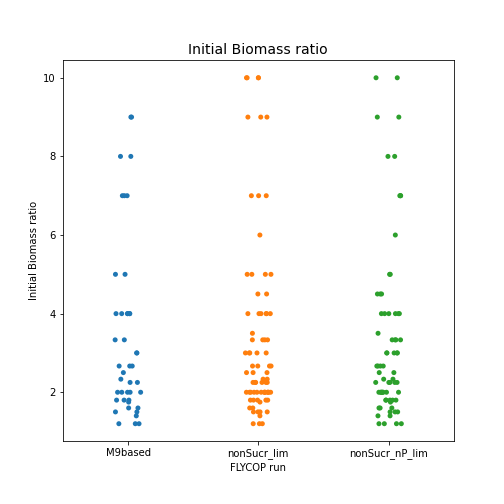{width=50%}
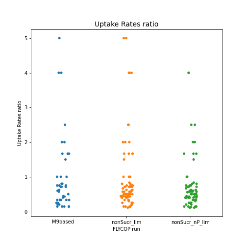{width=50%}

### 5.1.2. Final Biomass concentration {#NLim_M9_within_M9base_finalb}	

* **Final *E.coli* biomass** was higher for the FLYCOP runs with no sucrose limitation, and with no sucrose /$P_{i}$ limitation. The cloud of points for the M9based run ranged from 0 to 1.75 gL^-1^, while the cloud of final values for the other two runs ranged from around 1.0 to 2.2 gL^-1^ (approx.).

* Interestingly, **for *P.putida* the effect happened on the contrary**. For the M9based run, the cloud of points ranged from 0 to around 2.0 gL^-1^, while for the runs without sucrose and sucrose/ $P_{i}$ limitations, the main cluster of points ranged from 0 to around 1.0 gL^-1^. 

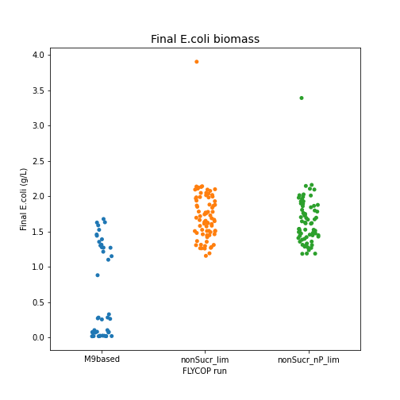{width=50%}
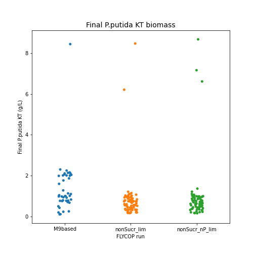{width=50%}

### 5.1.3. Final Product concentration {#NLim_M9_within_M9base_finalp}

* **Final naringenin concentration** should be considered essentially similar for the three FLYCOP runs, if reasonable production limits are to be considered. For the runs without sucrose and sucrose/ $P_{i}$ limitations, the upper limit for the cloud of points was slightly higher (60 mM) than for the M9based run (50 mM). There were also some more outliers for this last configuration. 

* As for **final pCA concentration**, this value was 0 or near 0 for a certain number of configurations in all FLYCOP runs. However, it was notably higher for the first FLYCOP runs (sucrose and $P_{i}$ limitations).

  * **M9based**. 35 in 43 (81%).
  * **nonSucr_lim**. 36 in 77 (47%).
  * **nonSucr_nP_lim**. 40 in 70 (57%).

  The rest of the values for each run ranged from 0 to a different upper limit.

  * **M9based**. 20 mM.
  * **nonSucr_lim** and **nonSucr_nP_lim**. 50 mM.
  
These distribution of points would indicate that pCA production was higher for those FLYCOP run without sucrose and sucrose /$P_{i}$ limitations.

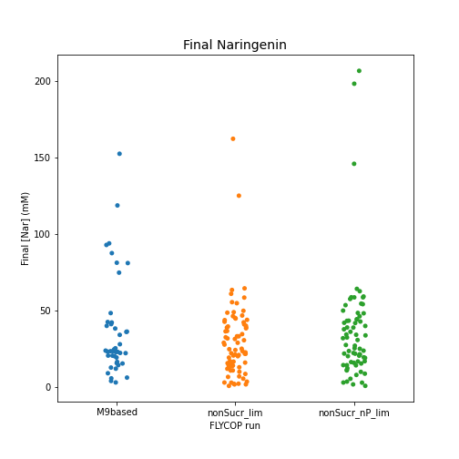{width=50%}
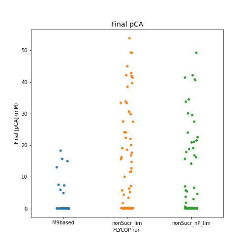{width=50%}

### 5.1.4. Final Nutrients concentration (N, P) {#NLim_M9_within_M9base_finalnut}

With respect to **final [$NH_{4}$] concentrations**, the distribution of points was as follows.

  * **M9based**. 31 in 43 (72%). The rest of final [$NH_{4}$] values ranged from 0 to 25 mM (i.e. $NH_{4}$ production because of death of microbes in some cases).
  * **nonSucr_lim**. 76 in 77 (99%).
  * **nonSucr_nP_lim**. 69 in 70 (99%).
  
As seen in these values, the absense of sucrose and sucrose/ $P_{i}$ limitations increased $NH_{4}$ consumption. \newline

With respect to **final $P_{i}$ concentrations**, the values obtained within the different FLYCOP runs were the following ones.

* **Configuration:  M9based**:

  - The number of low final [Pi] (under 1 mM) was:  32 in 43 (**74%**).
  - The number of low final [Pi] (between 1 to 10 mM) was:  0 in 43.
  - The number of intermediate final [Pi] (10-55 mM) was:  2 in 43.
  - The number of final [Pi] near original concentration (55-69.9 mM) was:  3 in 43.
  - The number of higher than initial or disproportionate final [Pi] (higher than 69.9 mM) was: 6 in 43 (14%). In **all** of these cases, final [$NH_{4}$] was 0 or nearly 0. 
  - The number of final [Pi] nearly 0 with final [nh4] nearly 0 was: 21 in 43 (21 in 31 values of $NH_{4}$ final exhaustion, **67%**). \newline
  
* **Configuration:  nonSucr_lim**:

  - The number of low final [Pi] (under 1 mM) was:  48 in 77 (**62%**).
  - The number of low final [Pi] (between 1 to 10 mM) was:  6 in 77.
  - The number of intermediate final [Pi] (10-55 mM) was:  15 in 77.
  - The number of final [Pi] near original concentration (55-69.9 mM) was:  3 in 77.
  - The number of higher than initial or disproportionate final [Pi] (higher than 69.9 mM) was:  5 in 77 (6%). In **all** of these cases, final [$NH_{4}$] was 0 or nearly 0. 
  - The number of final [Pi] nearly 0 with final [nh4] nearly 0 was:  48 in 77 (48 in 48 values of $NH_{4}$ final exhaustion, **100%**^). \newline.
  
* **Configuration:  nonSucr_nP_lim**:

  - The number of low final [Pi] (under 1 mM) was:  0 in 70.
  - The number of higher than initial or disproportionate final [Pi] (higher than 1000 mM) was:  6 in 70 (9%). In **all** of these cases, final [$NH_{4}$] was 0 or nearly 0. \newline

In general, the range of final $P_{i}$ values for each FLYCOP run was the following one.

  * **M9based**. Most of the values under around 70 mM. 6 outliers around 300-400 mM.
  * **nonSucr_lim**. Most of the values under around 70 mM. 6 outliers around 300-400 mM.
  * **nonSucr_nP_lim**. Most of the values between 700-1000 mM. 6 outliers around 1000-1400 mM.

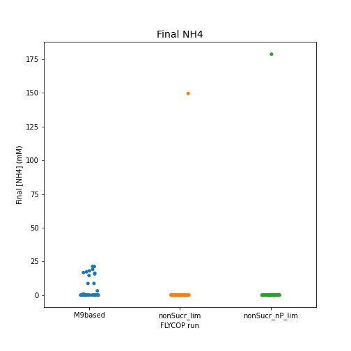{width=50%}
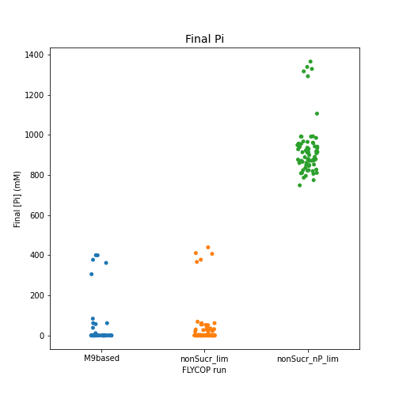{width=50%}

### 5.1.5. Conclusion and Further Implementing {#NLim_M9_within_M9base_conc}

* Regardless of the presence or absence of sucrose or sucrose/$P_{i}$ limitations, the **ratios for the optimal input parameters** (initial biomass, uptake rates) seemed to converge for the different FLYCOP runs. 

  - **Initial Biomass ratio** (*E.coli* / *P.putida*) points clustered between 0.5 to 3.0-4.0.
  - **Uptakes Rates ratio** (sucrose / fructose) points clustered under 1.0.
  
* Sucrose or sucrose/$P_{i}$ limitations conditioned the **final biomass concentrations** reached.
  
  - For *E.coli*, the growth was favored under no sucrose or sucrose/$P_{i}$ limitations.
  - However, an apparent inverse effect seemed to happen for *P.putida*: under sucrose/$P_{i}$ limitation, the upper limit for the growth of this microbe was higher. 
  
  A potential reason (to be further checked) is that a higher burden on *E.coli* growth might benefit *P.putida* growth, as long as *E.coli* continues to produce a minimum quantity or fructose (*P.putida* carbon source) and there is a certain level of $P_{i}$ in the media.

  Another issue to be considered in this sense is that *P.putida* might not be as dependent as *E.coli* on nitrogen (it might not require the same levels for biomass growth) (...).
  
* **Final naringenin concentration ranges** were similar for the FLYCOP runs with and without sucrose and sucrose/ $P_{i}$ limitations, specially if reasonable production levels were to be considered.

* However, **final pCA concentrations** were higher under no sucrose and sucrose/ $P_{i}$ limitations, as it was the case for final *E.coli* biomass.

* With respect to **nitrogen limitations**, the absence of sucrose and sucrose/ $P_{i}$ limitations seemed to increase $NH_{4}$ consumption.

* With respect to **final [$P_{i}$] values**, under $P_{i}$ limitations the consumption of this nutrient could be considered similar for sucrose-limited and unlimited configurations. 

  However, the **number of cases with both $NH_{4}$ and $P_{i}$ final exhaustion** was notably higher under sucrose-unlimited than under sucrose limited conditions.

  Finally, there were **a certain number of configurations with $P_{i}$ production** (with $NH_{4}$ final exhaustion) under sucrose-limited, sucrose-unlimited and sucrose/ $P_{i}$ unlimited conditions.

\newpage
## 5.2. M950N {#NLim_M9_within_M950N}


